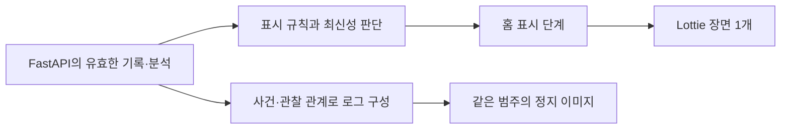

# 아기·양육자 일러스트와 모션 제작안

작성일: 2026-09-20
상태: 디자인 연구·이미지 초안·제작 명세. 실행 가능한 애니메이션이나 제품 연동 완료가 아님.
범위: A-12 캐릭터 제작, A-07 표현, A-04 정적 로그의 디자인 접점.

## 1. 제안

**큰 색면과 곡선으로 관계를 보여주는 편집 일러스트에, 읽기 쉬운 표정과 짧은 돌봄 동작을 결합한다.** Inside the Head의 조형 원리와 벡터 애니메이션 제작 구조를 참고하고, 아기·부모·돌봄 장면은 독자적으로 만든다.

이번 기준은 [사용자가 정한 범주 v2](../../product/baby-state-care-action-categories-v2.md)다. 참조 대화 “아기 부모 캐릭터 애니메이션 설계”의 마지막 범주 수정과 추가 답변을 확인했다. 초기 답변의 ‘기저귀 확인·재우기 시도’ 목록으로 되돌리지 않는다.

표현할 묶음은 다음과 같다.

- 보호자가 기록하는 관찰 상태 8종
- AI가 추정하는 원인 후보 5종과 판단 어려움 1종
- 실제로 완료한 돌봄 조치 8종
- 감지·분석 중, 실패, 울음 확인 안 됨은 별도의 시스템 표시

홈의 순서는 **최근 관찰 → 감지·분석 → AI 추정 → 조치·후속 상태 확인 저장 → 조치 장면 → 최신 관찰**이다. 로그는 같은 에셋의 정지 포즈를 쓴다.

## 2. 참조 사이트에서 확인한 것

확인 대상: [Inside the Head](https://insidethehead.co/), [Awwwards 소개](https://www.awwwards.com/sites/inside-the-head-publication). 소개는 2017년 수상 기록이고, 아래 구현 조사는 2026-09-20 공개 배포 코드와 실제 브라우저를 기준으로 한다.

### 디자인 관찰

| 특징 | 화면에서 보이는 방식 | 우리 서비스에 적용 |
|---|---|---|
| 큰 색면 | 외곽선·세부 묘사보다 단색 실루엣이 먼저 읽힘 | 피부·옷·머리·소품을 선명한 면으로 분리 |
| 곡선과 반복 | 길게 휘어진 팔, 반복되는 인체, 좌우 대응 | 보호자 팔의 C자 곡선이 아기를 감싸는 구성 |
| 겹침과 여백 | 인물의 앞뒤 관계와 배경의 빈 공간이 함께 형태를 만듦 | 손·아기 얼굴·수유 소품 사이의 여백 확보 |
| 제한된 색의 역할 | 진한 배경, 밝은 몸, 다른 색의 팔이 대비 | 본문은 밝은 배경, 캐릭터에 짙은 색과 따뜻한 색 배치 |
| 큰 일러스트와 적은 글 | 한 장면이 한 주제를 대표 | 홈의 캐릭터 한 장면에 상태 문구·출처·시각을 붙임 |
| 느린 변형과 반복 | 자세·곡선이 반복해서 변하며 시선을 유지 | 작은 대기 동작, 한 번 재생하는 완료 조치로 분리 |

얼굴의 생략, 극단적으로 늘인 팔다리, 거대한 몸의 잘림까지 그대로 가져오면 아기 표정과 돌봄 행동이 잘 안 읽힐 수 있다. 이번 캐릭터는 눈·눈썹·입을 남기고, 머리·손·접촉 지점이 잘리지 않는 구도로 바꾼다. 사용자가 첨부한 수유·부모와 아이 이미지에서는 인체를 지지하는 자세와 장면의 읽기 쉬움을 참고한다.

### 기술 조사: 확인·추론의 구분

| 항목 | 확인 결과와 근거 |
|---|---|
| 화면 구조 | 공개 번들에 Vue 컴포넌트·라우터와 Swiper 사용 코드가 있음 |
| 캐릭터 재생 | Lottie 컴포넌트가 loadAnimation을 호출하고 SVG 렌더러를 지정함 |
| 동작 데이터 | 번들에 Lottie/Bodymovin 형식의 벡터 도형, 위치·회전 키프레임, 애니메이션 경로가 포함됨 |
| 움직이는 방식 | 관절처럼 회전하는 그룹, 위치 이동, 벡터 경로 변형이 함께 존재함. 단순 이미지 전체 이동만으로 만든 효과가 아님 |
| 반복 | 래퍼에서 별도 해제하지 않으면 loop와 autoplay가 켜지는 구성. 챕터 사용부는 해제값을 전달하지 않음 |
| 프레임 정보 | 확인한 9개 데이터의 제작 프레임률은 24fps. 구간은 144~480프레임으로 약 6~20초. 실제 디스플레이 갱신률 측정값이 아님 |
| 장면 이동 | Swiper의 슬라이드 이동과 키보드 좌우 이동. 지정 이동 시간은 500ms |
| 페이지 전환 | CSS에 0.4초 투명도 전환이 있음 |
| 모바일 | Body·Mind에 별도 세로 데이터가 있고 Love도 작은 화면용 인스턴스를 가짐. CSS 960px 경계에서 표시를 바꿈 |
| 크기 맞춤 | 장면에 따라 SVG의 meet/slice를 선택해 맞추거나 잘라 채움 |
| 실제 렌더링 | 챕터 화면에서 SVG 11개, canvas 0개, video 0개 확인. Body 장면의 시간차 화면에서 자세 변화 확인 |
| 제작 원본 | After Effects 계열 도형 식별자와 Bodymovin 형식은 해당 제작 경로와 일치함. 원본 프로젝트나 제작자 작업 과정을 직접 확인한 것은 아님 |

확인한 공개 파일: [앱 코드](https://insidethehead.co/static/js/app.898ed3d9550642af4806.js), [라이브러리 코드](https://insidethehead.co/static/js/vendor.c6fbded86e1de7863189.js), [스타일](https://insidethehead.co/static/css/app.8ea166c46ab19c3b2fad4b2ff951f872.css). 해시와 조사 범위는 [조사 기록](source-audit.json)에 남긴다. 외부 원본 일러스트나 애니메이션 데이터를 프로젝트 자산으로 복사하지 않는다.

## 3. 캐릭터의 기준

### 외형과 관계

- 아기: 둥근 배 모양의 머리, 오른쪽으로 휘는 작은 쉼표 머리카락, 작은 콩 모양 눈, 움직일 수 있는 눈썹, 짧고 둥근 팔다리, 황토색 우주복.
- 보호자: 두세 덩어리로 정리한 짙은 머리카락, 간결한 얼굴, 파란 상의, 아기를 감싸는 넓고 둥근 팔. 첫 제작은 보호자 1명과 아기 1명으로 고정한다.
- 외형은 같은 인물임을 유지하는 기준이다. 실제 사용자의 성별·가족관계·수행자는 그림으로 추정하지 않는다.
- 보호자는 조용하고 집중하는 태도, 아기는 눈·눈썹·입·자세로 상태를 드러낸다. 행동을 완료할 때마다 아기를 웃게 만들지 않는다.
- 정면·3/4 측면·안긴 자세·누운 자세를 같은 디자인으로 그린다. 하나의 정면 리그를 극단적으로 비틀어 모든 자세를 만들지 않는다.

### 제안 팔레트

아래 값은 이번 작업의 디자인 제안이며 참조 사이트나 듀오링고의 공식 색상 규칙이 아니다.

| 역할 | 색 |
|---|---|
| 기본 배경 | 아이보리 #FFF6E7 |
| 머리·표정·텍스트 | 잉크 #232B43 |
| 보호자 옷·주요 색면 | 코발트 #4169C6 |
| 피부 | 살구 #F1BE96 |
| 아기 옷 | 황토 #E8BA63 |
| 소품·보조 면 | 세이지 #8AAB9A |
| 작은 강조 | 코럴 #E9786B |

색 자체에 진단·성공·실패 의미를 맡기지 않는다. 관찰·AI 추정·조치는 글과 도형으로도 구별한다. 생성 PNG의 색은 시안이며, 편집 가능한 벡터 원본 제작 때 위 토큰을 적용하고 대비를 검사한다.

### 듀오링고 스킬을 적용한 부분

필요한 디테일만 남기기, 작은 크기의 실루엣, 같은 캐릭터를 재사용하는 형태 언어는 [공식 그림체 제작 글](https://blog.duolingo.com/shape-language-duolingos-art-style/)을 참고한다. 몸과 표정 같은 요소를 독립적으로 조합하는 접근은 [공식 캐릭터 모션 사례](https://blog.duolingo.com/world-character-visemes/)를 참고한다.

Duo의 외형이나 학습 정답 보상은 이식하지 않는다. 아래 시간·각도·크기·재생 규칙은 이번 서비스의 제안이다. 과거 브랜드 가이드의 일부 인체 규칙은 현재 전체 원문을 확인한 규칙으로 취급하지 않는다.

## 4. 관찰 상태 8종: 표정과 자세

[관찰 상태 이미지 초안](concepts/01-observation-states.png)

| 범주 / 현재 코드 | 대표 정지 포즈 | 제안 모션 |
|---|---|---|
| 우는 중 / CRYING | 찡그린 눈, 열린 입, 올라간 두 손, 절제된 눈물 | 어깨가 작게 올라갔다 내려감. 2초 내외 1주기 후 휴지 |
| 칭얼거림 / FUSSING | 눈썹을 모음, 작은 굽은 입, 안쪽으로 모은 손 | 몸을 조금 틀었다 돌아옴. 눈물 없이 울음과 구분 |
| 편안해 보임 / CALM | 힘을 푼 손·어깨, 편안한 눈과 작은 입선 | 4~6초에 한 번 깜박임과 아주 작은 숨 움직임 |
| 즐거워 보임 / CHEERFUL_APPEARING | 웃는 입, 올라간 한 팔과 굽힌 다리 | 짧은 팔 움직임 1회 후 미소 포즈 유지 |
| 깨어 있음 / AWAKE | 열린 눈, 중립 입, 살짝 돌린 머리 | 한 번 둘러보고 정면으로. 즐거움·진정을 추가하지 않음 |
| 졸려 보임 / SLEEPY_APPEARING | 반쯤 감은 눈, 하품, 볼 근처의 손 | 3~4초 하품 1회. 완전히 잠든 눈으로 끝내지 않음 |
| 잠듦 / ASLEEP | 감은 눈, 이완된 팔, 누운 자세 | 아주 작은 숨 움직임. 침구·접촉 자세는 별도 검수 |
| 상태 확인 못함 / UNKNOWN | 중립 포즈와 분리된 물음 기호 | 정지. 감정이나 수면을 추정하는 동작 없음 |

현재 서버의 visual_state_code는 UNKNOWN 대신 NEUTRAL을 사용한다. 원본 관찰 UNKNOWN과 그림 NEUTRAL의 의미를 구분해 매핑한다. 기록 없음·충돌·미확인도 같은 중립 자산을 재사용할 수 있지만 문구와 이유는 별개다.

호환되는 복수 상태와 대표 포즈의 선택은 범주 v2를 따른다. 확인된 state_codes와 B의 visual_mapping_version을 유지한다. 같은 시점의 AWAKE+ASLEEP처럼 충돌하는 입력은 임의의 표정 우선순위로 숨기지 않는다. 30분이 지난 관찰은 정지 그림과 경과시간을 강조한다.

## 5. AI 추정 5종과 판단 어려움: 가설을 표시하는 기호

[AI 추정 이미지 초안](concepts/02-ai-inferences.png)

모델 표현은 별도의 표시 단계다. 단정적인 감정 표정보다 아기 곁의 점선 말풍선·가능성 문구로 울음의 의미를 전달한다. 아기 본체의 기본 포즈를 공유하고 기호만 바꾸면 원인별로 다른 아기를 만들 필요가 없다. 이 그림은 관찰 기록을 생성하지 않는다.

| 범주 / 연구 라벨 | 대표 기호와 동작 | 표현 경계 |
|---|---|---|
| 배고픔 가능성 / hungry | 우유 방울과 컵을 말풍선에 표시. 방울이 한 번 떠오름 | 수유 방식·먹인 양·배부름을 추정하지 않음 |
| 졸림·피곤함 가능성 / tired | 작은 달이 천천히 기울어짐 | 아기를 잠든 포즈로 바꾸지 않음 |
| 트림 필요 가능성 / burping | 위쪽 곡선 화살표와 공기 원이 말풍선 안에서 이동 | 실제 트림이 나온 듯한 입김을 붙이지 않음 |
| 배 불편함 가능성 / belly_pain | 말풍선 안의 부드러운 배 곡선·나선 | 붉은 통증 표적이나 질병·해부도 표현 없음 |
| 일반적인 불편함 가능성 / discomfort | 추상적인 굽은 선이 작게 정돈됨 | 기저귀·온도·외로움 등 특정 원인 기호를 자동 부여하지 않음 |
| 판단 어려움 / 대체 표현 | 물음 기호와 중립 포즈, 정지 | 여섯 번째 원인 라벨이 아님 |

AI 추정 배지·분석 시각·가능성 문구는 그림 바깥의 HTML 텍스트로 유지한다. 내부 점수에 임의의 확률 막대나 백분율을 붙이지 않는다.

새 사건의 COMPLETE이며 실제 지원 라벨에 해당하는 경우에만 후보별 장면을 사용한다. ABSTAIN은 판단 어려움 안내, FAILED는 처리 실패와 재시도 안내, NO_CRY는 ‘울음 확인 안 됨’ 안내 후 최근 관찰로 복귀한다. 모델이 우는 모습이나 편안한 상태를 새로 관찰한 것으로 처리하지 않는다. 현재 단계에서는 다섯 범주 모두가 서비스에서 활성화되거나 검증됐다고 주장하지 않는다.

## 6. 완료한 조치 8종: 두 인물이 함께 만드는 장면

[돌봄 조치 이미지 초안](concepts/03-care-actions.png)

| 조치 | 시작 → 동작 → 대표 정지 포즈 | 완료 조건과 변형 |
|---|---|---|
| 수유함 | 지지하는 팔 고정 → 수유 도구를 입 쪽으로 → 수유 접촉 포즈 | 확인한 수유 방식에 따라 모유·분유·혼합을 준비. 초안의 젖병은 한 변형이며, 방식 미상에는 젖병을 단정하지 않는 공통 표현 |
| 기저귀 갈아줌 | 누운 아기와 보호자 손 → 새 기저귀 양옆 고정 → 교체한 기저귀와 손 | 실제 교체만. 기저귀 확인은 제외 |
| 안아줌 | 두 팔 접근 → 머리·몸을 지지하며 품으로 → C자 포옹 | 안는 동작만으로 미소·잠듦을 붙이지 않음 |
| 토닥여줌 | 한 팔로 지지 → 다른 손이 등에서 2회 움직임 → 손을 댄 포즈 | 트림·수면 결과 기호 없음 |
| 트림시킴 | 세운 자세와 지지 → 등 돌봄 → 확인된 트림을 작은 기호로 표시 | 실제 트림 확인이 있어야 이 장면 선택. 시도만 있으면 자동 선택 금지 |
| 재워줌 | 지지해 내려놓기 → 손을 빼기 → 잠든 아기와 곁의 보호자 | 재우는 돌봄과 실제 잠듦 확인 필요. 수유 뒤 잠듦을 이 행동으로 자동 추가하지 않음 |
| 환경 바꿔줌 | 스위치·소품 접근 → 실제 조절 → 변경된 환경 소품 | 초안은 조명 변형. 소리·온도 등 무엇을 바꿨는지 확인된 변형만 사용. 불명확하면 공통 조절 기호 |
| 기타 완료 조치 | 구체적 돌봄 → 완료 포즈 | 초안은 옷 갈아입히기 예시. 씻기·놀이도 추후 별도 변형. 내용 미상에 옷 갈아입히기를 단정하지 않음 |

손·팔·아기 접촉 위치가 의미를 좌우한다. 안기·수유·토닥임은 두 인물을 한 장면 원본에 배치하고 공유 기준점으로 맞춘다. 매 프레임 아기의 머리·몸 지지가 끊기거나 손이 관통하지 않도록 검수한다. 대표 정지 포즈는 반드시 마지막 프레임일 필요는 없다.

조치당 **1.6~2.4초, 1회**를 시작값으로 제안한다. 24fps 제작 기준 약 38~58프레임이며 조치별로 최종 프레임 수를 정한다. 준비 15% → 주동작 60% → 정지 25% 정도로 여유를 두고, 아기를 튀기거나 팔을 탄성 있게 늘리는 과장은 피한다. 기록 저장·다음 입력은 재생 완료를 기다리지 않는다. 여러 조치는 확인된 sequence를 지키며 ‘건너뛰기’를 제공한다.

## 7. 제작 구조와 도구

추천 순서는 **시안 → 부위별 SVG 원본 → Lottie Creator → Lottie JSON → 기존 Next.js 웹의 SVG 플레이어**다.

[Lottie Creator 공식 문서](https://docs.lottiefiles.com/en/creator)는 SVG 가져오기와 JSON/dotLottie 내보내기를 지원한다. [공식 MCP 문서](https://docs.lottiefiles.com/en/creator/13_ai-tools/lottie-creator-mcp)는 AI 도구 연결과 레이어·키프레임 편집을 설명한다. 현재 이 작업에서 Lottie Creator·Rive 편집 도구는 연결되지 않았고, 연결·내보내기 시험을 실행하지 않았다.

처음에는 lottie-web의 SVG 렌더러로 참조 사이트와 같은 계열의 결과를 확인한다. [공식 API](https://github.com/airbnb/lottie-web)는 구간 재생·정지·속도 제어를 제공한다. dotLottie를 채택한다면 해당 전용 런타임의 렌더러·기능·정지 이미지 출력을 별도로 시험한다. 파일 확장자만 바꿔 기존 플레이어에 연결하지 않는다.

Rive는 몸·표정·소품의 동시 조합이나 연속 입력 반응이 크게 늘 때 비교한다. [Rive 상태 머신](https://rive.app/docs/editor/state-machine/state-machine)과 [데스크톱 MCP](https://rive.app/docs/editor/ai/mcp)를 활용할 수 있지만, 이번 짧은 장면을 만들기 위해 두 도구를 모두 도입할 필요는 없다.

### 원본 구조

아래는 제안하는 원본 레이어 구조다. 실제 파일이 완성됐다는 뜻은 아니다.

```text
scene
  caregiver
    hair_back
    torso
    arm_back / forearm_back / hand_back
    head / eyes / brows / mouth
    arm_front / forearm_front / hand_front
  baby
    body / left_arm / right_arm / left_leg / right_leg
    head / curl / brows / eyes / mouth / tears
  props
    bottle / diaper / lamp / clothing
  hypothesis_symbols
  background
```

- 팔·손·얼굴에 회전 중심을 지정하고 앞팔·뒷팔의 겹침 순서를 정의한다.
- 관찰 8종은 공통 아기 원본에서 표정·포즈를 바꾼다. 누운 자세는 별도 포즈 원본을 둔다.
- AI 5종은 공통 본체와 원인 기호를 조합한다.
- 안기와 토닥임은 공통 접촉 자세를 쓰되 주동작과 정지 포즈를 구분한다.
- 입과 눈은 소수의 벡터 경로로 만들고, 형태 변형이 필요하면 경로 점 수·방향을 맞춘다.
- PNG 한 장을 자동 벡터화하면 움직이는 관절·가려진 팔·원하는 겹침 순서가 자동으로 생기지 않는다. 선택한 시안을 부위별로 재구성해야 한다.
- 실제 UI 문구와 배지는 애니메이션에 굽지 않고 HTML로 표시한다. 번역·스크린리더·문구 수정에 대응한다.

### 원본 하나에서 두 산출물

각 범주의 제작 원본으로 움직이는 Lottie와 대표 정지 SVG/PNG를 함께 내보낸다. 에셋 목록에 식별자, 원본 버전, 모션 경로, poster 경로, 대표 프레임, 대체 텍스트, 허용 입력을 기록한다. 이미지 초안은 이 제작 원본의 시각적 목표다.

홈은 240~320 CSS px 정도의 장면을 첫 시험 크기로 잡고, 로그는 56~72px를 기준으로 검수한다. 모두 제안값이다. 로그 크기에서 안기·토닥임이 구별되지 않으면 큰 얼굴·손·소품만 남긴 간략 정지 변형을 원본에서 별도로 만든다.

## 8. 웹과 서버의 역할



서버는 사실·출처·식별자·버전·권한과 상태 매핑을 소유한다. 웹은 재생 순서, 현재 재생 중인 장면, 중단·건너뛰기, 모션 감소를 소유한다. 애니메이션의 완료 이벤트는 UI 재생 종료이고, 행동 저장 성공이나 진정 확인의 근거가 아니다.

| 입력 | 홈에서 할 일 |
|---|---|
| 유효한 최신 확인 관찰 | 관찰 포즈·출처·관찰 시각 표시 |
| 현재 아기의 새로운 울음 사건 | 이전 조치 재생 중단, 감지·분석 안내 |
| 현재 사건의 유효한 COMPLETE 결과 | 지원하는 1순위 후보 장면과 AI 추정 문구 |
| 현재 기록 흐름의 조치 확인 저장 성공 | 확인된 조치를 순서대로 1회 재생 |
| 조치 재생 종료·건너뛰기 | 원래 캡처해둔 값 대신 현재 가장 최신의 유효한 관찰을 다시 선택 |
| 조치 후 상태보다 오래된 분석이 늦게 도착 | 홈은 새 관찰 유지, 분석은 해당 사건 로그에서 확인 |
| 저장 응답 재수신·폴링·새로고침·다른 보호자 동기화 | 조회 결과 갱신. 같은 행동의 수행 장면을 새로 만들지 않음 |
| 과거 기록 추가·수정·로그 탐색 | 과거 항목 갱신. 홈에서 당시 조치 재연 금지 |
| 아기·계정 전환, 삭제·권한 회수 | 재생·대기열·기존 범위의 자산 연결 정리 |

action_id는 수행 장면의 동일성을, version은 수정본의 유효성을, Idempotency-Key는 저장 요청의 중복 방지를 담당한다. 이 값을 합친 새 ID 때문에 같은 행동이 다시 재생되지 않도록 한다. 재생은 ‘이 화면에서 시작한 새 확인 저장의 성공’에만 연결하고 재조회 데이터를 재생 이벤트로 해석하지 않는다.

느린 자산 로딩·오류·동작 줄이기에서는 같은 의미의 정지 그림과 텍스트로 넘어간다. 탭 숨김 시 모션을 멈추고, 복귀 시 오래된 조치 대기열을 몰아서 재생하지 않는다. 앱의 마이크 감지 수명주기와 관찰 공백 규칙은 별도로 유지한다.

## 9. Git 그래프 느낌의 정적 로그

중심선에는 보호자 관찰, 사건별 가지에는 감지·AI 추정·조치를 둔다. 조치 후 관찰은 중심선의 원본 기록을 한 번만 참조한다. 아래는 관계를 설명하는 예시이며 실제 화면은 최신 기록을 위에 둔다.

```text
● 14:00 편안해 보임 · 보호자 관찰
│
├── ◇ 14:05 울음 감지
│   ◇ 14:06 배고픔 가능성 · AI 추정
│   ■ 14:10 수유함 · 실제 수행자
│   ■ 14:12 트림시킴 · 실제 수행자
│   │
●───┘ 14:15 우는 중 · 조치 후 관찰
```

합류는 ‘조치 후 상태 기록이 연결됨’을 뜻한다. 우는 상태여도 합류하며 해결·성공·원인 정답을 뜻하지 않는다. 후속 상태가 없으면 가지를 닫지 않고 ‘후속 상태 미기록’을 표시한다.

관찰은 원형+관찰 배지, AI는 마름모·점선+AI 추정 배지, 조치는 사각형+조치 이름을 사용한다. 스크롤 진입·선택 때도 그림을 재생하지 않는다. 로그 항목마다 Lottie 플레이어를 만들지 않고 정지 에셋을 쓴다. 긴 기록은 필요한 행만 렌더링하고 연결선은 같은 사건 ID·원본 기록 관계에서 계산한다.

색상은 보조 구분이다. 각 행에는 기록 시각과 출처, 수행자, 상태/조치 이름이 남는다. 그림과 본문이 같은 뜻을 반복하면 그림은 장식으로 처리하고 텍스트를 읽게 한다.

## 10. 현재 계약과 연결하기 전에 남은 일

검토 기준: origin/develop 22e3d02, OpenAPI 1.1.1. 작업 중 도착한 A 작업표 갱신을 반영했으며 A-12 내용은 동일함을 확인했다.

- 관찰 8종과 visual_state_code는 현재 계약에 있다.
- DraftAction/RecommendedAction에는 DIAPER_CHECK·SLEEP_PREPARATION이 있고, 완료 조치 범주와 일대일 대응하지 않는다. 계약에 없는 행동 enum을 프런트엔드에서 새로 보내지 않는다.
- 토닥여줌·재워줌·트림 완료 확인·기타 세부 변형은 실제 CareEvent와 확인 기록에서 어느 필드로 표현할지 B와 매핑을 확정해야 한다. BURPING이나 SLEEP_PREPARATION이라는 이름만 보고 결과 완료 장면을 선택하지 않는다.
- 사용자 범주 v2의 홈 단계와 현재 A-12의 ‘관찰은 표정, 후보는 문구·기호’ 원칙을 함께 만족하도록, AI 단계의 화면 표현과 관찰 원본의 분리를 계약·목·화면 매핑에 반영해야 한다.
- 이번 작업은 디자인 초안이다. 계약·OpenAPI·앱 코드를 부분 수정하거나 A-12 완료 표시를 하지 않았다.
- 후속 계약 변경에서는 사용자에게 이미 승인받은 범주를 다시 승인받는 절차를 만들지 않고, 필요한 필드·오류·목·검증을 함께 갱신한다.

## 11. 실제 제작 순서와 검수 기준

1. 이번 시안에서 아기 얼굴·보호자 실루엣을 선택하고 기준 원본을 만든다.
2. 우는 중, 안아줌, 편안해 보임의 세 장면과 정지 포즈를 먼저 만든다.
3. 안기 뒤에도 우는 경우를 추가해, 안기 모션이 진정을 자동으로 뜻하지 않는지 확인한다.
4. 합성 입력으로 홈 전환·중단·건너뛰기·늦은 결과·중복 응답·새로고침을 확인한다.
5. 같은 자산의 정지 포즈를 사건 로그에 연결한다.
6. 같은 제작 구조로 나머지 관찰·모델 기호·조치를 확장한다.
7. 계약 매핑과 실제 저장 연동, 모바일에서 감지와 동시 사용을 검증한다.

완료 기준은 다음과 같다.

- 240~320px 장면과 56~72px 로그에서 주요 표정·행동을 구별할 수 있음
- 우는 중/칭얼거림, 안기/토닥임/트림 완료, 졸림/잠듦이 구별됨
- 반복 첫·끝 프레임의 위치가 튀지 않고 접촉 포인트가 유지됨
- 모션 도중 새 사건·아기 전환·삭제가 와도 이전 장면이 되살아나지 않음
- 저장 실패·초안·추천 클릭·재수신이 완료 장면을 재생하지 않음
- 재생 종료 후 실제 최신 관찰로 돌아가며 AI 추정과 출처가 섞이지 않음
- 동작 줄이기·화면 읽기·자산 로딩 실패에서 기록을 이해하고 이용 가능
- 실제 휴대전화에서 감지와 동시 사용 시 프레임 드롭·메모리·배터리 영향을 측정함

위 항목은 후속 검수 기준이다. 이번에는 실행 가능한 애니메이션·실제 API·권한·기기·모델 검증을 수행하지 않았다.

## 12. 산출물과 출처

- [대표 장면](concepts/00-character-key-art.png): 큰 곡선과 색면으로 구성한 ‘안아줌’ 방향
- 이미지 3장: 관찰 상태 8종, AI 추정 5종과 유보, 돌봄 조치 8종의 콘셉트 시트
- [생성 프롬프트](generation-prompts.md): 내장 image_gen 사용, 생성·수정 의도와 원본 추적
- [사이트 조사 기록](source-audit.json): 공개 코드·브라우저에서 확인한 기술과 범위
- [이미지 생성 출처·파일 정보](image-provenance.json): 최종 선택 PNG의 원본 위치, 크기와 해시
- 편집 가능한 SVG/Figma 원본, Lottie JSON, Rive 파일, 웹 플레이어는 이번 전달물에 포함되지 않음

시트 사이에 남은 머리 비율·옷 윤곽·작은 명암 차이는 벡터 원본을 만들 때 하나의 기준 캐릭터로 맞춰야 한다. 현재 PNG의 선을 자동 추출해 그대로 리그로 쓰는 단계는 검증하지 않았다. 조치 시트의 수유·환경 변경·기타는 각각 젖병·조명·옷 갈아입히기 변형의 예시다.

이번 확인 결과: 최종 이미지 4장(각 1536×1024)을 열어 제목·포즈·범주를 검토했고, 환경 변경·옷 갈아입히기의 자동 수면 인상을 수정했다. 판단 어려움의 얼굴도 중립으로 수정했다. 로컬 문서 링크, PNG 파일·해시, 22개 표현의 문서 포함 여부, 관찰 코드 8종과 OpenAPI의 일치를 검사했다. 작은 실제 UI 크기에서의 이해도나 모션 품질·성능을 검증한 결과는 아니다.

주요 공식 자료:

- [Inside the Head](https://insidethehead.co/) 및 위 공개 코드
- [Duolingo 형태 언어](https://blog.duolingo.com/shape-language-duolingos-art-style/)
- [Duolingo 캐릭터 모션](https://blog.duolingo.com/world-character-visemes/)
- [Lottie Creator](https://docs.lottiefiles.com/en/creator)
- [Lottie Creator 가져오기](https://docs.lottiefiles.com/en/creator/09_assets-and-importing/importing)
- [Lottie Creator MCP](https://docs.lottiefiles.com/en/creator/13_ai-tools/lottie-creator-mcp)
- [lottie-web](https://github.com/airbnb/lottie-web)
- [Rive 상태 머신](https://rive.app/docs/editor/state-machine/state-machine)
- [Rive MCP](https://rive.app/docs/editor/ai/mcp)
