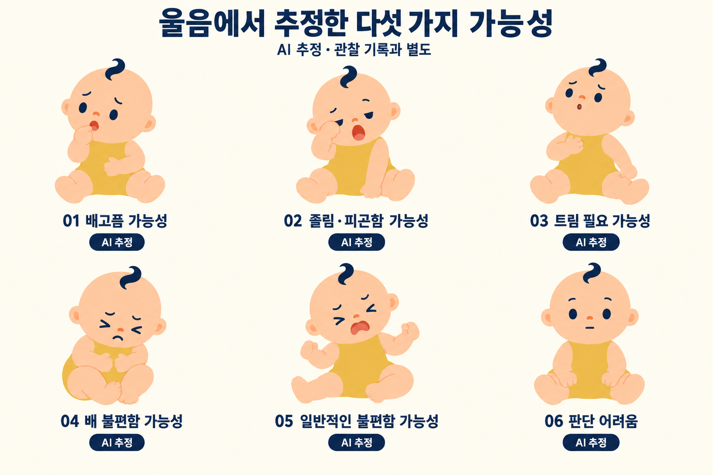
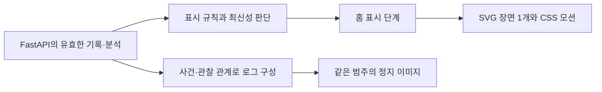

# 아기·양육자 일러스트와 모션 제작안

작성일: 2026-09-20
수정: AI 추정 시안을 아기의 표정·자세로 교체하고 웹 컴포넌트 제작 방식을 우선안으로 반영.
상태: 디자인 연구·이미지 초안·제작 명세. 실행 가능한 애니메이션이나 제품 연동 완료가 아님.
범위: A-12 캐릭터 제작, A-07 표현, A-04 정적 로그의 디자인 접점.

## 1. 제안

**큰 색면과 곡선으로 관계를 보여주는 편집 일러스트에, 읽기 쉬운 표정과 짧은 돌봄 동작을 결합한다.** Inside the Head의 조형 원리와 벡터 애니메이션 제작 구조를 참고하고, 아기·부모·돌봄 장면은 독자적으로 만든다.

첫 제작은 **React 컴포넌트 + 인라인 SVG + CSS 애니메이션**을 권장한다. SVG는 HTML 안에 넣을 수 있는 벡터 그림이고, CSS는 그 안의 눈·입·손·몸을 움직인다. 재생 순서·취소가 필요한 조치는 브라우저의 Web Animations API를 함께 사용한다. Lottie·Rive는 복잡한 변형과 편집 작업이 늘 때 선택할 수 있는 후속 경로다. 구체적인 가능 범위와 한계는 7절에 정리했다.

이번 기준은 [사용자가 정한 범주 v2](../../product/baby-state-care-action-categories-v2.md)다. 참조 대화 “아기 부모 캐릭터 애니메이션 설계”의 마지막 범주 수정과 추가 답변을 확인했다. 초기 답변의 ‘기저귀 확인·재우기 시도’ 목록으로 되돌리지 않는다.

표현할 묶음은 다음과 같다.

- 보호자가 기록하는 관찰 상태 8종
- AI가 추정하는 원인 후보 5종과 판단 어려움 1종
- 실제로 완료한 돌봄 조치 8종
- 감지·분석 중, 실패, 울음 확인 안 됨은 별도의 시스템 표시

홈의 순서는 **최근 관찰 → 감지·분석 → AI 추정 → 조치·후속 상태 확인 저장 → 조치 장면 → 최신 관찰**이다. 로그는 같은 에셋의 정지 포즈를 쓴다.

## 2. 참조 사이트에서 확인한 것

확인 대상: [Inside the Head](https://insidethehead.co/), [Awwwards 소개](https://www.awwwards.com/sites/inside-the-head-publication). 소개는 2017년 수상 기록이고, 아래 구현 조사는 2026-09-20 공개 배포 코드와 실제 브라우저를 기준으로 한다.

### 디자인 관찰

| 특징 | 화면에서 보이는 방식 | 우리 서비스에 적용 |
|---|---|---|
| 큰 색면 | 외곽선·세부 묘사보다 단색 실루엣이 먼저 읽힘 | 피부·옷·머리·소품을 선명한 면으로 분리 |
| 곡선과 반복 | 길게 휘어진 팔, 반복되는 인체, 좌우 대응 | 보호자 팔의 C자 곡선이 아기를 감싸는 구성 |
| 겹침과 여백 | 인물의 앞뒤 관계와 배경의 빈 공간이 함께 형태를 만듦 | 손·아기 얼굴·수유 소품 사이의 여백 확보 |
| 제한된 색의 역할 | 진한 배경, 밝은 몸, 다른 색의 팔이 대비 | 본문은 밝은 배경, 캐릭터에 짙은 색과 따뜻한 색 배치 |
| 큰 일러스트와 적은 글 | 한 장면이 한 주제를 대표 | 홈의 캐릭터 한 장면에 상태 문구·출처·시각을 붙임 |
| 느린 변형과 반복 | 자세·곡선이 반복해서 변하며 시선을 유지 | 작은 대기 동작, 한 번 재생하는 완료 조치로 분리 |

얼굴의 생략, 극단적으로 늘인 팔다리, 거대한 몸의 잘림까지 그대로 가져오면 아기 표정과 돌봄 행동이 잘 안 읽힐 수 있다. 이번 캐릭터는 눈·눈썹·입을 남기고, 머리·손·접촉 지점이 잘리지 않는 구도로 바꾼다. 사용자가 첨부한 수유·부모와 아이 이미지에서는 인체를 지지하는 자세와 장면의 읽기 쉬움을 참고한다.

### 기술 조사: 확인·추론의 구분

| 항목 | 확인 결과와 근거 |
|---|---|
| 화면 구조 | 공개 번들에 Vue 컴포넌트·라우터와 Swiper 사용 코드가 있음 |
| 캐릭터 재생 | Lottie 컴포넌트가 loadAnimation을 호출하고 SVG 렌더러를 지정함 |
| 동작 데이터 | 번들에 Lottie/Bodymovin 형식의 벡터 도형, 위치·회전 키프레임, 애니메이션 경로가 포함됨 |
| 움직이는 방식 | 관절처럼 회전하는 그룹, 위치 이동, 벡터 경로 변형이 함께 존재함. 단순 이미지 전체 이동만으로 만든 효과가 아님 |
| 반복 | 래퍼에서 별도 해제하지 않으면 loop와 autoplay가 켜지는 구성. 챕터 사용부는 해제값을 전달하지 않음 |
| 프레임 정보 | 확인한 9개 데이터의 제작 프레임률은 24fps. 구간은 144~480프레임으로 약 6~20초. 실제 디스플레이 갱신률 측정값이 아님 |
| 장면 이동 | Swiper의 슬라이드 이동과 키보드 좌우 이동. 지정 이동 시간은 500ms |
| 페이지 전환 | CSS에 0.4초 투명도 전환이 있음 |
| 모바일 | Body·Mind에 별도 세로 데이터가 있고 Love도 작은 화면용 인스턴스를 가짐. CSS 960px 경계에서 표시를 바꿈 |
| 크기 맞춤 | 장면에 따라 SVG의 meet/slice를 선택해 맞추거나 잘라 채움 |
| 실제 렌더링 | 챕터 화면에서 SVG 11개, canvas 0개, video 0개 확인. Body 장면의 시간차 화면에서 자세 변화 확인 |
| 제작 원본 | After Effects 계열 도형 식별자와 Bodymovin 형식은 해당 제작 경로와 일치함. 원본 프로젝트나 제작자 작업 과정을 직접 확인한 것은 아님 |

확인한 공개 파일: [앱 코드](https://insidethehead.co/static/js/app.898ed3d9550642af4806.js), [라이브러리 코드](https://insidethehead.co/static/js/vendor.c6fbded86e1de7863189.js), [스타일](https://insidethehead.co/static/css/app.8ea166c46ab19c3b2fad4b2ff951f872.css). 해시와 조사 범위는 [조사 기록](source-audit.json)에 남긴다. 외부 원본 일러스트나 애니메이션 데이터를 프로젝트 자산으로 복사하지 않는다.

## 3. 캐릭터의 기준

### 외형과 관계

- 아기: 둥근 배 모양의 머리, 오른쪽으로 휘는 작은 쉼표 머리카락, 작은 콩 모양 눈, 움직일 수 있는 눈썹, 짧고 둥근 팔다리, 황토색 우주복.
- 보호자: 두세 덩어리로 정리한 짙은 머리카락, 간결한 얼굴, 파란 상의, 아기를 감싸는 넓고 둥근 팔. 첫 제작은 보호자 1명과 아기 1명으로 고정한다.
- 외형은 같은 인물임을 유지하는 기준이다. 실제 사용자의 성별·가족관계·수행자는 그림으로 추정하지 않는다.
- 보호자는 조용하고 집중하는 태도, 아기는 눈·눈썹·입·자세로 상태를 드러낸다. 행동을 완료할 때마다 아기를 웃게 만들지 않는다.
- 정면·3/4 측면·안긴 자세·누운 자세를 같은 디자인으로 그린다. 하나의 정면 리그를 극단적으로 비틀어 모든 자세를 만들지 않는다.

### 제안 팔레트

아래 값은 이번 작업의 디자인 제안이며 참조 사이트나 듀오링고의 공식 색상 규칙이 아니다.

| 역할 | 색 |
|---|---|
| 기본 배경 | 아이보리 #FFF6E7 |
| 머리·표정·텍스트 | 잉크 #232B43 |
| 보호자 옷·주요 색면 | 코발트 #4169C6 |
| 피부 | 살구 #F1BE96 |
| 아기 옷 | 황토 #E8BA63 |
| 소품·보조 면 | 세이지 #8AAB9A |
| 작은 강조 | 코럴 #E9786B |

색 자체에 진단·성공·실패 의미를 맡기지 않는다. 관찰·AI 추정·조치는 글과 도형으로도 구별한다. 생성 PNG의 색은 시안이며, 편집 가능한 벡터 원본 제작 때 위 토큰을 적용하고 대비를 검사한다.

### 듀오링고 스킬을 적용한 부분

필요한 디테일만 남기기, 작은 크기의 실루엣, 같은 캐릭터를 재사용하는 형태 언어는 [공식 그림체 제작 글](https://blog.duolingo.com/shape-language-duolingos-art-style/)을 참고한다. 몸과 표정 같은 요소를 독립적으로 조합하는 접근은 [공식 캐릭터 모션 사례](https://blog.duolingo.com/world-character-visemes/)를 참고한다.

Duo의 외형이나 학습 정답 보상은 이식하지 않는다. 아래 시간·각도·크기·재생 규칙은 이번 서비스의 제안이다. 과거 브랜드 가이드의 일부 인체 규칙은 현재 전체 원문을 확인한 규칙으로 취급하지 않는다.

## 4. 관찰 상태 8종: 표정과 자세

[관찰 상태 이미지 초안](concepts/01-observation-states.png)

| 범주 / 현재 코드 | 대표 정지 포즈 | 제안 모션 |
|---|---|---|
| 우는 중 / CRYING | 찡그린 눈, 열린 입, 올라간 두 손, 절제된 눈물 | 어깨가 작게 올라갔다 내려감. 2초 내외 1주기 후 휴지 |
| 칭얼거림 / FUSSING | 눈썹을 모음, 작은 굽은 입, 안쪽으로 모은 손 | 몸을 조금 틀었다 돌아옴. 눈물 없이 울음과 구분 |
| 편안해 보임 / CALM | 힘을 푼 손·어깨, 편안한 눈과 작은 입선 | 4~6초에 한 번 깜박임과 아주 작은 숨 움직임 |
| 즐거워 보임 / CHEERFUL_APPEARING | 웃는 입, 올라간 한 팔과 굽힌 다리 | 짧은 팔 움직임 1회 후 미소 포즈 유지 |
| 깨어 있음 / AWAKE | 열린 눈, 중립 입, 살짝 돌린 머리 | 한 번 둘러보고 정면으로. 즐거움·진정을 추가하지 않음 |
| 졸려 보임 / SLEEPY_APPEARING | 반쯤 감은 눈, 하품, 볼 근처의 손 | 3~4초 하품 1회. 완전히 잠든 눈으로 끝내지 않음 |
| 잠듦 / ASLEEP | 감은 눈, 이완된 팔, 누운 자세 | 아주 작은 숨 움직임. 침구·접촉 자세는 별도 검수 |
| 상태 확인 못함 / UNKNOWN | 중립 포즈와 분리된 물음 기호 | 정지. 감정이나 수면을 추정하는 동작 없음 |

현재 서버의 visual_state_code는 UNKNOWN 대신 NEUTRAL을 사용한다. 원본 관찰 UNKNOWN과 그림 NEUTRAL의 의미를 구분해 매핑한다. 기록 없음·충돌·미확인도 같은 중립 자산을 재사용할 수 있지만 문구와 이유는 별개다.

호환되는 복수 상태와 대표 포즈의 선택은 범주 v2를 따른다. 확인된 state_codes와 B의 visual_mapping_version을 유지한다. 같은 시점의 AWAKE+ASLEEP처럼 충돌하는 입력은 임의의 표정 우선순위로 숨기지 않는다. 30분이 지난 관찰은 정지 그림과 경과시간을 강조한다.

## 5. AI 추정 5종과 판단 어려움: 아기가 상태를 느끼는 표정과 자세



사용자의 수정 요청에 따라 말풍선과 원인 기호를 없애고, **그 상태를 느끼는 아기 한 명의 일러스트**로 바꿨다. 기존 관찰 시트와 같은 머리 형태·쉼표 머리카락·피부색·황토색 옷을 쓰되, 손의 위치와 몸의 실루엣까지 원인별로 구분한다. 표정만 바꾼 동일 포즈를 반복하지 않는다.

| 범주 / 연구 라벨 | 수정한 대표 정지 포즈 | 제안 모션 | 표현 경계 |
|---|---|---|---|
| 배고픔 가능성 / hungry | 입가로 가져간 한 손, 배 위의 다른 손, 먹을 것을 찾는 듯 살짝 돌린 얼굴 | 손을 입가로 가져가고 고개를 조금 돌린 뒤 포즈 유지 | 수유 장면·먹은 양·배부름을 추가하지 않음 |
| 졸림·피곤함 가능성 / tired | 내려간 눈꺼풀, 하품, 눈을 비비는 손, 처진 어깨 | 손으로 눈을 한 번 비비고 짧게 하품한 뒤 반쯤 뜬 눈으로 유지 | 잠듦과 구분 |
| 트림 필요 가능성 / burping | 가슴 위쪽에 둔 손, 세운 상체와 조금 들린 턱, 작게 오므린 입 | 상체를 조금 젖혔다 세우며 답답한 포즈 유지 | 트림이 실제로 나온 입김·성공 표현 없음 |
| 배 불편함 가능성 / belly_pain | 두 손으로 아랫배를 감쌈, 안으로 당긴 무릎, 웅크린 몸과 찡그린 얼굴 | 배에 손을 붙인 채 몸과 무릎을 함께 조금 안으로 모음 | 붉은 통증 표적·질병·해부도 표현 없음 |
| 일반적인 불편함 가능성 / discomfort | 바깥으로 벌린 두 팔, 비대칭 다리, 비틀린 몸과 보채는 얼굴 | 좌우로 작게 뒤척이며 팔다리를 서로 다른 방향으로 움직임 | 배를 감싸는 포즈와 구분. 기저귀·온도 같은 특정 원인을 덧붙이지 않음 |
| 판단 어려움 / 대체 표현 | 열린 눈, 작은 수평 입, 힘을 뺀 손과 중립 자세 | 정지 | 여섯 번째 원인 라벨이 아님 |

위 포즈는 원인 후보를 전달하기 위한 일러스트의 연출이며, 실제 아기의 증상을 판별하는 기준이 아니다. 그림은 상태를 직접 표현하고, **AI 추정 배지·분석 시각·가능성 문구는 그림 바깥의 HTML 텍스트**가 담당한다. 관찰 기록은 별도로 유지하며, 이 그림이 관찰을 자동 생성하지 않는다. 내부 점수에 임의의 확률 막대나 백분율을 붙이지 않는다.

새 사건의 COMPLETE이며 실제 지원 라벨에 해당하는 경우에만 후보별 장면을 사용한다. ABSTAIN은 판단 어려움 안내, FAILED는 처리 실패와 재시도 안내, NO_CRY는 ‘울음 확인 안 됨’ 안내 후 최근 관찰로 복귀한다. 모델이 우는 모습이나 편안한 상태를 새로 관찰한 것으로 처리하지 않는다. 현재 단계에서는 다섯 범주 모두가 서비스에서 활성화되거나 검증됐다고 주장하지 않는다.

## 6. 완료한 조치 8종: 두 인물이 함께 만드는 장면

[돌봄 조치 이미지 초안](concepts/03-care-actions.png)

| 조치 | 시작 → 동작 → 대표 정지 포즈 | 완료 조건과 변형 |
|---|---|---|
| 수유함 | 지지하는 팔 고정 → 수유 도구를 입 쪽으로 → 수유 접촉 포즈 | 확인한 수유 방식에 따라 모유·분유·혼합을 준비. 초안의 젖병은 한 변형이며, 방식 미상에는 젖병을 단정하지 않는 공통 표현 |
| 기저귀 갈아줌 | 누운 아기와 보호자 손 → 새 기저귀 양옆 고정 → 교체한 기저귀와 손 | 실제 교체만. 기저귀 확인은 제외 |
| 안아줌 | 두 팔 접근 → 머리·몸을 지지하며 품으로 → C자 포옹 | 안는 동작만으로 미소·잠듦을 붙이지 않음 |
| 토닥여줌 | 한 팔로 지지 → 다른 손이 등에서 2회 움직임 → 손을 댄 포즈 | 트림·수면 결과 기호 없음 |
| 트림시킴 | 세운 자세와 지지 → 등 돌봄 → 확인된 트림을 작은 기호로 표시 | 실제 트림 확인이 있어야 이 장면 선택. 시도만 있으면 자동 선택 금지 |
| 재워줌 | 지지해 내려놓기 → 손을 빼기 → 잠든 아기와 곁의 보호자 | 재우는 돌봄과 실제 잠듦 확인 필요. 수유 뒤 잠듦을 이 행동으로 자동 추가하지 않음 |
| 환경 바꿔줌 | 스위치·소품 접근 → 실제 조절 → 변경된 환경 소품 | 초안은 조명 변형. 소리·온도 등 무엇을 바꿨는지 확인된 변형만 사용. 불명확하면 공통 조절 기호 |
| 기타 완료 조치 | 구체적 돌봄 → 완료 포즈 | 초안은 옷 갈아입히기 예시. 씻기·놀이도 추후 별도 변형. 내용 미상에 옷 갈아입히기를 단정하지 않음 |

손·팔·아기 접촉 위치가 의미를 좌우한다. 안기·수유·토닥임은 두 인물을 한 장면 원본에 배치하고 공유 기준점으로 맞춘다. 매 프레임 아기의 머리·몸 지지가 끊기거나 손이 관통하지 않도록 검수한다. 대표 정지 포즈는 반드시 마지막 프레임일 필요는 없다.

조치당 **1.6~2.4초, 1회**를 시작값으로 제안한다. 24fps 제작 기준 약 38~58프레임이며 조치별로 최종 프레임 수를 정한다. 준비 15% → 주동작 60% → 정지 25% 정도로 여유를 두고, 아기를 튀기거나 팔을 탄성 있게 늘리는 과장은 피한다. 기록 저장·다음 입력은 재생 완료를 기다리지 않는다. 여러 조치는 확인된 sequence를 지키며 ‘건너뛰기’를 제공한다.

## 7. 제작 구조와 도구

### 7-1. HTML·CSS만으로 가능한가

**가능하다. 이번 시안에는 HTML 안에 SVG를 넣고 CSS로 움직이는 방식이 가장 적합한 첫 선택이다.** SVG는 브라우저가 직접 그리는 벡터 요소이며 React 컴포넌트로 작성할 수 있다. 손·눈·입을 각각 선택해 색과 움직임을 줄 수 있다. CSS로 SVG 요소를 다루는 방식과 키프레임 애니메이션은 브라우저 표준에 포함된다. [SVG와 CSS](https://developer.mozilla.org/en-US/docs/Web/SVG/Tutorials/SVG_from_scratch/SVG_and_CSS), [CSS 애니메이션](https://developer.mozilla.org/en-US/docs/Web/CSS/Guides/Animations/Using).

기존 [웹 패키지](../../../apps/web/package.json)는 Next.js·React 기반이고, 확인한 의존성 목록에는 전용 모션 라이브러리가 없다. 이번 제안의 첫 구현은 새 재생 라이브러리 없이 시작할 수 있다. 기술의 사용 가능성을 검토한 결과이며, 이 캐릭터의 브라우저 구현·성능을 시험했다는 뜻은 아니다.

| 구성 방식 | 만들 수 있는 것 | 이번 시안에서의 판단 |
|---|---|---|
| HTML의 div + CSS만 사용 | 원·타원·둥근 사각형으로 만든 캐릭터, 깜박임·이동·회전 | 간단한 원리 확인은 가능. 팔·머리카락·안긴 자세의 독자적인 곡선을 유지하려면 모양과 겹침 관리가 복잡해져 전체 캐릭터의 우선안으로 삼지 않음 |
| 인라인 SVG + CSS | 원하는 곡선을 그린 부위, 표정 교체, 손·머리·몸의 회전·이동, 짧은 반복 | **기본안.** 관찰 8종과 AI 추정 5종, 중립 포즈를 같은 캐릭터 부품으로 제작 |
| 같은 SVG + Web Animations API | 조치의 순차 재생, 일시정지, 취소, 건너뛰기 | **필요한 조치에 추가.** 그림 형식은 그대로 두고 브라우저 JavaScript로 재생을 제어 |
| 부위별 벡터 + Lottie 편집·재생 | 복잡한 시간표, 여러 곡선의 연속 변형, 디자이너 중심의 키프레임 편집 | 그런 장면이 실제로 필요해지면 해당 장면에 선택적으로 도입 |
| 부위별 벡터 + Rive | 많은 입력에 반응하는 조합과 상태 전환을 전용 편집기에서 제작 | 표정·몸·입력 조합이 커질 때 후속 비교. 현재 범위의 필수 도구는 아님 |

이 비교의 적합성 판단은 이번 시안과 작업 범위에 대한 설계 의견이다. HTML div만으로 만들 수 없는 것은 아니지만, SVG도 웹 컴포넌트의 일부이므로 굳이 제외할 이점이 적다.

### 7-2. 그림 제작과 움직임 제작을 나눈다

추천 순서는 **수정 시안 → 부위별 SVG 경로 → React 장면 컴포넌트 → CSS 동작 → 필요한 조치에 재생 제어 추가**다.

1. PNG를 참고해 아기의 얼굴·몸·팔다리와 보호자의 팔을 벡터 경로로 다시 만든다. SVG 코드를 직접 작성해도 되고, 벡터 편집기에서 그린 뒤 가져와도 된다.
2. 한 캐릭터의 얼굴과 색상 기준을 공통으로 쓰면서, 정면·3/4 측면·안긴 자세·누운 자세의 포즈 원본을 만든다.
3. 눈·입·팔을 부품으로 나누고 움직일 부위를 그룹으로 묶는다. 감싼 팔·아기·앞손의 앞뒤 순서를 포즈별로 정한다.
4. 우선 회전·이동·작은 확대/축소와 표정 교체로 구현한다. 모든 형태를 연속적으로 변형해야 한다고 가정하지 않는다.
5. 같은 포즈를 움직임 없이 표시하는 정지 모드와 로그용 정지 SVG/PNG도 함께 준비한다.

생성된 PNG 한 장에는 관절이나 분리된 팔이 없다. CSS를 그 PNG에 적용하면 그림 전체는 움직일 수 있지만, 눈과 손을 독립적으로 움직이려면 먼저 부위별 원본을 만들어야 한다. **전용 애니메이션 앱은 생략할 수 있어도, 움직일 수 있게 그림을 구성하는 작업은 필요하다.**

아래는 SVG 내부의 제안 구조다. 실제 원본이나 컴포넌트가 완성됐다는 뜻은 아니다.

```text
scene
  caregiver
    hair_back
    torso
    arm_back / forearm_back / hand_back
    head / eyes / brows / mouth
    arm_front / forearm_front / hand_front
  baby
    body / left_arm / right_arm / left_leg / right_leg
    head / curl / brows / eyes / mouth / tears
  props
    bottle / diaper / lamp / clothing
  background
```

- 팔·손·얼굴에 회전 중심을 지정하고 앞팔·뒷팔의 겹침 순서를 정의한다.
- 관찰 8종은 공통 아기 원본에서 표정·포즈를 바꾼다. 누운 자세는 별도 포즈 원본을 둔다.
- AI 5종도 같은 아기 부품을 쓰되, 입가에 손을 대기·눈 비비기·가슴 짚기·배 감싸기·뒤척이기의 포즈를 각각 만든다. 말풍선 레이어는 사용하지 않는다.
- 안기와 토닥임은 공통 접촉 자세를 쓰되 주동작과 정지 포즈를 구분한다.
- 입과 눈은 소수의 벡터 경로 변형을 준비한다. 하품·찡그림은 원본 교체나 짧은 전환으로 시작하고, 매 프레임 경로를 새로 계산하는 방식은 첫 구현에서 제외한다.
- 실제 UI 문구와 배지는 애니메이션에 굽지 않고 HTML로 표시한다. 번역·스크린리더·문구 수정에 대응한다.

### 7-3. 어떤 부위를 어떻게 움직일지

| 장면 | 움직임을 주는 부위 | 웹에서의 제작 방식 |
|---|---|---|
| 깜박임·졸린 눈 | 눈꺼풀·눈 그룹 | 세로 크기 변화 또는 눈 모양 교체. 얼굴 전체를 납작하게 만들지 않음 |
| 하품 | 입·머리·눈 비비는 팔 | 열린 입 모양으로 전환하고, 머리 기울기와 팔 회전을 짧게 연결 |
| 배고픔 | 손·팔꿈치·머리 | 입가로 손을 옮기고 머리를 조금 돌림. 손과 입의 접촉 지점을 맞춤 |
| 트림 필요 | 상체·머리·가슴 위의 손 | 상체와 손을 함께 작은 각도로 기울여 답답한 자세 표현 |
| 배 불편함 | 몸통·무릎·배 위의 두 손 | 몸을 모으는 포즈를 기본으로 하고 접촉한 부위가 함께 움직이게 그룹화 |
| 일반적인 불편함 | 몸통·양팔·양다리 | 팔다리에 조금 다른 시작 시점과 회전값을 주어 뒤척임을 만듦 |
| 안아줌 | 보호자 팔·아기·지지 손 | 접촉한 아기와 지지 손을 공통 기준점으로 움직여 품에 안기는 동작 제작 |
| 토닥여줌 | 토닥이는 손 | 지지 팔과 아기를 고정하고 손만 두 번 작게 이동 |
| 수유함 | 지지 팔·아기·수유 도구 | 머리와 팔의 지지를 유지하며 도구를 입으로 이동. 이후 접촉 유지 |
| 장면 변경 | 이전·다음 포즈 그룹 | 전혀 다른 자세는 짧은 투명도 전환으로 연결. 팔을 과하게 늘여 억지로 연결하지 않음 |

CSS 반복은 깜박임·작은 대기 동작에 쓰고, 조치의 시작·중단·건너뛰기는 JavaScript에서 제어한다. Web Animations API는 재생·일시정지·취소와 완료 처리를 제공하므로 외부 플레이어 없이 이 역할을 맡길 수 있다. 같은 부위의 같은 속성을 CSS와 JavaScript가 동시에 제어하지 않도록 나눈다. [Web Animations API](https://developer.mozilla.org/en-US/docs/Web/API/Web_Animations_API/Using_the_Web_Animations_API).

SVG의 회전 기준은 HTML 상자와 다를 수 있다. 단순 부위는 `transform-box: fill-box`와 `transform-origin`을 지정하고, 어깨·팔꿈치처럼 접촉이 중요한 곳은 포즈 원본의 고정 좌표를 기준으로 중첩 그룹을 만든다. 위치를 잡는 바깥 그룹과 CSS로 움직이는 안쪽 그룹을 나누면 기본 배치와 동작이 서로 덮어쓰는 문제를 줄일 수 있다. [SVG 변환 기준](https://developer.mozilla.org/en-US/docs/Web/CSS/Reference/Properties/transform-box).

### 7-4. 컴포넌트와 상태 제어

다음은 프런트엔드 내부 구성 제안이며 새로운 서버 필드나 API enum을 뜻하지 않는다.

| 구성 | 역할 |
|---|---|
| CharacterScene | 관찰·AI 추정·조치에 해당하는 한 장면을 선택하고 출처 문구를 함께 표시 |
| BabyFigure / CaregiverFigure | 공통 부위·색·포즈를 렌더링. 좌우 팔과 표정 같은 실제 SVG 요소를 소유 |
| pose catalog | 장면별 포즈·정지 그림·대체 텍스트·움직일 수 있는 부위의 목록 |
| motion controller | 정지·대기·1회 재생, 중단·건너뛰기, 새 입력 도착을 처리 |
| CharacterPoster | 로그와 동작 줄이기에서 사용하는 대표 정지 장면. 재생 인스턴스 없음 |

서버의 결과·관찰·저장 성공을 검증한 뒤 해당 장면을 고른다. 단순 렌더링이나 데이터 재조회가 조치 재생을 시작하지 않게 한다. 취소할 때는 진행 중인 애니메이션과 예약된 후속 동작을 함께 정리하고, 취소된 완료 콜백이 오래된 장면을 되살리지 않게 현재 실행과 일치하는지 확인한다. 취소로 거절되는 완료 Promise도 처리한다.

기본 SVG 자체가 읽을 수 있는 정지 포즈여야 한다. CSS 로딩 전, JavaScript 실행 전, 동작 중단 후에도 의미가 남아야 하며, 핵심 몸통을 애니메이션의 마지막 프레임에서만 보이게 만들지 않는다. 같은 장면이 여러 곳에 나타나면 SVG의 마스크·클립 식별자가 서로 충돌하지 않게 한다.

`prefers-reduced-motion`에서는 대표 정지 포즈를 사용한다. CSS 애니메이션을 끄는 것과 함께 JavaScript 모션도 시작하지 않도록 처리한다. 탭 숨김은 `visibilitychange`로 감지해 중지하고, 복귀 시 현재 유효한 장면을 다시 고른다. [동작 줄이기](https://developer.mozilla.org/en-US/docs/Web/CSS/Reference/At-rules/@media/prefers-reduced-motion), [페이지 표시 상태](https://developer.mozilla.org/en-US/docs/Web/API/Document/visibilitychange_event).

### 7-5. 웹 컴포넌트 방식의 한계와 Lottie를 선택할 조건

Inside the Head에서 보이는 부드러운 인체 변형에는 **부위의 이동·회전 외에 곡선 자체의 변화**가 포함된다. 이번 시안의 표정·손동작·짧은 돌봄은 웹 컴포넌트로 충분히 시도할 수 있지만, 원본의 모든 곡선이 유기적으로 변하는 느낌까지 단순 회전만으로 같아지지는 않는다.

SVG에서도 곡선 경로를 코드로 바꿀 수 있다. 다만 포즈 사이의 중간 모양·겹침·접촉을 직접 설계하고 검수해야 한다. 긴 팔의 윤곽을 계속 바꾸거나, 많은 부위를 정교한 시간표로 조정하거나, 디자이너가 자주 모션을 직접 편집해야 한다면 전용 편집기의 이점이 커진다. 이때 해당 장면을 Lottie로 제작하는 선택을 한다.

[Lottie Creator](https://docs.lottiefiles.com/en/creator)는 SVG 가져오기와 JSON/dotLottie 내보내기 경로를 제공하며, [lottie-web](https://github.com/airbnb/lottie-web)은 구간 재생·정지·속도 제어에 사용할 수 있다. dotLottie는 전용 런타임과 출력 결과를 따로 검증한다. [Rive 상태 머신](https://rive.app/docs/editor/state-machine/state-machine)은 입력 조합이 크게 늘 때 비교한다. 현재 이 작업에서는 전용 편집기 연결이나 내보내기 시험을 실행하지 않았다.

도구 이름만으로 품질이나 성능이 결정되지는 않는다. 먼저 배고픔·졸림·배 불편함과 안아줌·토닥여줌을 부위별 SVG로 제작해, 표정 가독성·접촉 유지·수정 난도를 확인한다. 여기서 해결되지 않는 변형이 있을 때 그 장면만 전용 도구와 비교한다.

### 7-6. 원본 하나에서 움직임과 정지 그림을 만든다

우선안에서는 같은 SVG 경로·포즈 정의로 움직이는 React 장면과 정지 모드를 만든다. 로그에 필요한 SVG/PNG는 대표 포즈를 고정해 별도로 내보낼 수 있다. 에셋 목록에는 식별자, 원본 버전, 컴포넌트/모션 정의 위치, poster 경로, 대표 포즈, 대체 텍스트, 허용 입력을 기록한다. Lottie를 쓰는 장면만 애니메이션 파일 경로·대표 프레임을 추가한다.

홈은 240~320 CSS px 정도의 장면을 첫 시험 크기로 잡고, 로그는 56~72px를 기준으로 검수한다. 모두 제안값이다. 로그 크기에서 안기·토닥임이 구별되지 않으면 큰 얼굴·손·소품만 남긴 간략 정지 변형을 원본에서 별도로 만든다. 홈에서 한 장면만 재생하고 긴 로그는 정지 파일을 사용한다. SVG라는 이유만으로 빠르다고 가정하지 않고 실제 기기에서 마이크 감지와 함께 측정한다.

## 8. 웹과 서버의 역할



서버는 사실·출처·식별자·버전·권한과 상태 매핑을 소유한다. 웹은 재생 순서, 현재 재생 중인 장면, 중단·건너뛰기, 모션 감소를 소유한다. 애니메이션의 완료 이벤트는 UI 재생 종료이고, 행동 저장 성공이나 진정 확인의 근거가 아니다.

| 입력 | 홈에서 할 일 |
|---|---|
| 유효한 최신 확인 관찰 | 관찰 포즈·출처·관찰 시각 표시 |
| 현재 아기의 새로운 울음 사건 | 이전 조치 재생 중단, 감지·분석 안내 |
| 현재 사건의 유효한 COMPLETE 결과 | 지원하는 1순위 후보 장면과 AI 추정 문구 |
| 현재 기록 흐름의 조치 확인 저장 성공 | 확인된 조치를 순서대로 1회 재생 |
| 조치 재생 종료·건너뛰기 | 원래 캡처해둔 값 대신 현재 가장 최신의 유효한 관찰을 다시 선택 |
| 조치 후 상태보다 오래된 분석이 늦게 도착 | 홈은 새 관찰 유지, 분석은 해당 사건 로그에서 확인 |
| 저장 응답 재수신·폴링·새로고침·다른 보호자 동기화 | 조회 결과 갱신. 같은 행동의 수행 장면을 새로 만들지 않음 |
| 과거 기록 추가·수정·로그 탐색 | 과거 항목 갱신. 홈에서 당시 조치 재연 금지 |
| 아기·계정 전환, 삭제·권한 회수 | 재생·대기열·기존 범위의 자산 연결 정리 |

action_id는 수행 장면의 동일성을, version은 수정본의 유효성을, Idempotency-Key는 저장 요청의 중복 방지를 담당한다. 이 값을 합친 새 ID 때문에 같은 행동이 다시 재생되지 않도록 한다. 재생은 ‘이 화면에서 시작한 새 확인 저장의 성공’에만 연결하고 재조회 데이터를 재생 이벤트로 해석하지 않는다.

느린 자산 로딩·오류·동작 줄이기에서는 같은 의미의 정지 그림과 텍스트로 넘어간다. 탭 숨김 시 모션을 멈추고, 복귀 시 오래된 조치 대기열을 몰아서 재생하지 않는다. 앱의 마이크 감지 수명주기와 관찰 공백 규칙은 별도로 유지한다.

## 9. Git 그래프 느낌의 정적 로그

중심선에는 보호자 관찰, 사건별 가지에는 감지·AI 추정·조치를 둔다. 조치 후 관찰은 중심선의 원본 기록을 한 번만 참조한다. 아래는 관계를 설명하는 예시이며 실제 화면은 최신 기록을 위에 둔다.

```text
● 14:00 편안해 보임 · 보호자 관찰
│
├── ◇ 14:05 울음 감지
│   ◇ 14:06 배고픔 가능성 · AI 추정
│   ■ 14:10 수유함 · 실제 수행자
│   ■ 14:12 트림시킴 · 실제 수행자
│   │
●───┘ 14:15 우는 중 · 조치 후 관찰
```

합류는 ‘조치 후 상태 기록이 연결됨’을 뜻한다. 우는 상태여도 합류하며 해결·성공·원인 정답을 뜻하지 않는다. 후속 상태가 없으면 가지를 닫지 않고 ‘후속 상태 미기록’을 표시한다.

관찰은 원형+관찰 배지, AI는 마름모·점선+AI 추정 배지, 조치는 사각형+조치 이름을 사용한다. 이 도형은 로그의 출처 구분이며 아기 주변의 말풍선이 아니다. 스크롤 진입·선택 때도 그림을 재생하지 않는다. 로그 항목마다 모션 제어기를 만들지 않고 정지 에셋을 쓴다. 긴 기록은 필요한 행만 렌더링하고 연결선은 같은 사건 ID·원본 기록 관계에서 계산한다.

색상은 보조 구분이다. 각 행에는 기록 시각과 출처, 수행자, 상태/조치 이름이 남는다. 그림과 본문이 같은 뜻을 반복하면 그림은 장식으로 처리하고 텍스트를 읽게 한다.

## 10. 현재 계약과 연결하기 전에 남은 일

검토 기준: origin/develop 22e3d02, OpenAPI 1.1.1. 작업 중 도착한 A 작업표 갱신을 반영했으며 A-12 내용은 동일함을 확인했다.

- 관찰 8종과 visual_state_code는 현재 계약에 있다.
- DraftAction/RecommendedAction에는 DIAPER_CHECK·SLEEP_PREPARATION이 있고, 완료 조치 범주와 일대일 대응하지 않는다. 계약에 없는 행동 enum을 프런트엔드에서 새로 보내지 않는다.
- 토닥여줌·재워줌·트림 완료 확인·기타 세부 변형은 실제 CareEvent와 확인 기록에서 어느 필드로 표현할지 B와 매핑을 확정해야 한다. BURPING이나 SLEEP_PREPARATION이라는 이름만 보고 결과 완료 장면을 선택하지 않는다.
- 사용자 범주 v2와 이번 명시적 수정 요청은 AI 추정 단계에서도 원인별 아기 포즈를 사용한다. 현재 계약·A-12의 ‘관찰은 표정, 후보는 문구·기호’ 규칙과는 표시 방식에 차이가 있다. 실제 연동 때 별도의 AI 표시 단계와 출처 배지를 반영하고, 관찰 원본을 덮어쓰지 않는 규칙을 계약·목·화면 매핑에 함께 갱신해야 한다.
- 이번 작업은 디자인 초안이다. 계약·OpenAPI·앱 코드를 부분 수정하거나 A-12 완료 표시를 하지 않았다.
- 후속 계약 변경에서는 사용자에게 이미 승인받은 범주를 다시 승인받는 절차를 만들지 않고, 필요한 필드·오류·목·검증을 함께 갱신한다.

## 11. 실제 제작 순서와 검수 기준

1. 수정 시안의 얼굴·옷·보호자 실루엣을 부위별 SVG 원본으로 정리한다.
2. 배고픔·졸림·배 불편함의 포즈와 작은 동작을 React·SVG·CSS로 먼저 제작해 서로 구별되는지 확인한다.
3. 안아줌·토닥여줌을 추가해 접촉과 중단을 검수한다. 복잡한 곡선 변형이 실제로 부족한 장면만 Lottie 제작과 비교한다.
4. 우는 중·편안해 보임을 연결하고, 안기 뒤에도 우는 경우를 확인해 조치가 진정을 자동으로 뜻하지 않게 한다.
5. 합성 입력으로 홈 전환·중단·건너뛰기·늦은 결과·중복 응답·새로고침을 확인한다.
6. 같은 자산의 정지 포즈를 사건 로그에 연결하고 나머지 관찰·모델 추정 포즈·조치로 확장한다.
7. 계약 매핑과 실제 저장 연동, 모바일에서 감지와 동시 사용을 검증한다.

완료 기준은 다음과 같다.

- 240~320px 장면과 56~72px 로그에서 주요 표정·행동을 구별할 수 있음
- 우는 중/칭얼거림, 안기/토닥임/트림 완료, 졸림/잠듦이 구별됨
- 말풍선 없이도 배고픔/트림 필요/배 불편함/일반 불편함의 손 위치·몸 자세가 구별됨
- 반복 첫·끝 프레임의 위치가 튀지 않고 접촉 포인트가 유지됨
- 모션 도중 새 사건·아기 전환·삭제가 와도 이전 장면이 되살아나지 않음
- 저장 실패·초안·추천 클릭·재수신이 완료 장면을 재생하지 않음
- 재생 종료 후 실제 최신 관찰로 돌아가며 AI 추정과 출처가 섞이지 않음
- 동작 줄이기·화면 읽기·자산 로딩 실패에서 기록을 이해하고 이용 가능
- CSS·JavaScript 모션 모두 동작 줄이기와 탭 숨김에 대응하고, 취소 뒤 오래된 완료 콜백이 재생을 이어가지 않음
- 실제 휴대전화에서 감지와 동시 사용 시 프레임 드롭·메모리·배터리 영향을 측정함

위 항목은 후속 검수 기준이다. 이번에는 실행 가능한 애니메이션·실제 API·권한·기기·모델 검증을 수행하지 않았다.

## 12. 산출물과 출처

- [대표 장면](concepts/00-character-key-art.png): 큰 곡선과 색면으로 구성한 ‘안아줌’ 방향
- 이미지 3장: 관찰 상태 8종, AI 추정 5종과 유보, 돌봄 조치 8종의 콘셉트 시트
- [생성 프롬프트](generation-prompts.md): 내장 image_gen 사용, 이번 수정 프롬프트 전문과 이전 생성 기록
- [사이트 조사 기록](source-audit.json): 공개 코드·브라우저에서 확인한 기술과 범위
- [이미지 생성 출처·파일 정보](image-provenance.json): 최종 선택 PNG의 원본 위치, 크기와 해시
- 편집 가능한 SVG/Figma 원본, Lottie JSON, Rive 파일, 웹 플레이어는 이번 전달물에 포함되지 않음

시트 사이에 남은 머리 비율·옷 윤곽·작은 명암 차이는 벡터 원본을 만들 때 하나의 기준 캐릭터로 맞춰야 한다. 현재 PNG의 선을 자동 추출해 그대로 리그로 쓰는 단계는 검증하지 않았다. 조치 시트의 수유·환경 변경·기타는 각각 젖병·조명·옷 갈아입히기 변형의 예시다.

첫 제작에서는 이미지 4장(각 1536×1024)을 열어 제목·포즈·범주를 검토했고, 환경 변경·옷 갈아입히기의 자동 수면 인상과 판단 어려움의 얼굴을 수정했다. 관찰 코드 8종과 OpenAPI의 일치도 확인했다.

이번 수정에서는 AI 추정 시트의 말풍선을 모두 없애고 다섯 가지 자세와 중립 포즈를 확인했다. 나머지 이미지 3장은 보존했다. 웹 패키지와 MDN 문서를 확인해 SVG·CSS·Web Animations API 기반 제작안을 추가했고, 문서 링크·범주·이미지 크기와 해시를 검사했다. 실제 컴포넌트·애니메이션은 아직 제작하지 않았으며, 작은 실제 UI에서의 이해도·브라우저별 동작·마이크 동시 사용 성능·실제 API·권한·기기·모델 연동은 검증하지 않았다.

주요 공식 자료:

- [Inside the Head](https://insidethehead.co/) 및 위 공개 코드
- [Duolingo 형태 언어](https://blog.duolingo.com/shape-language-duolingos-art-style/)
- [Duolingo 캐릭터 모션](https://blog.duolingo.com/world-character-visemes/)
- [Lottie Creator](https://docs.lottiefiles.com/en/creator)
- [Lottie Creator 가져오기](https://docs.lottiefiles.com/en/creator/09_assets-and-importing/importing)
- [Lottie Creator MCP](https://docs.lottiefiles.com/en/creator/13_ai-tools/lottie-creator-mcp)
- [lottie-web](https://github.com/airbnb/lottie-web)
- [Rive 상태 머신](https://rive.app/docs/editor/state-machine/state-machine)
- [Rive MCP](https://rive.app/docs/editor/ai/mcp)
