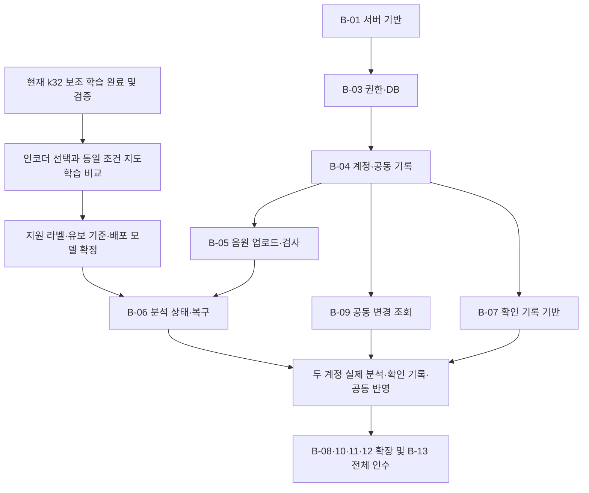

# B 담당 구현 계획 — 현재 군집 보조 학습에서 첫 통합 시연까지

> 이관 안내: 2026-09-19 작성 당시의 계획·관측 기록입니다. 진행률·프로세스·마감 시각·검증 여부는 이번 이관에서 새로 확인하지 않았습니다. 현재 작업표와 계약은 [문서 안내](../../README.md)에서 확인합니다.

작성일: 2026년 9월 19일 · 현황 관측: **19:36 KST** · 적용 계약: **팀 개발 계약 1.0.0**

**제출 조건 업데이트: 9월 20일 안에 링크 제출 필수.** 정확한 마감 시각은 미확인이다. 내부 목표는 9월 20일 18시 기능 동결·20시 제출 준비 완료이며, 공식 마감이 이보다 이르면 앞당긴다. 마감 전 실행 순서는 [9월 20일 링크 제출 계획](SUBMISSION-PLAN.md)을 우선하고, 이 문서는 전체 B-01~B-13의 구현 기준으로 사용한다.

이 계획은 「내가 맡을 일.md」의 B-01~B-13을 현재 코드·실행 기록과 연결한다. 이번 산출물은 진행 현황 확인과 구현 계획이다. 제품 코드 작성, 추가 학습 실행, 클라우드 변경 및 실제 API 검증을 수행한 결과가 아니다. 실행 중인 학습의 코드·설정·체크포인트는 변경하지 않았다.

**현재 위치는 B-02의 모델 선검증을 진행하고, B-06에 연결할 학습 자산을 만드는 단계다. 모델 연구와 함께 B-01·B-03·B-04의 서버 기반을 시작할 수 있다.** 군집 보조 학습이 끝나도 원인 분류 지도학습, 서비스용 모델 내보내기, API 연결, 배포 성능 검증은 별도로 남는다.

## 1. 확인한 진행 현황

| 영역 | 현재 판정 | 직접 확인한 근거와 의미 |
|---|---|---|
| 팀 역할·API 계약 | 문서 준비 완료 | 팀 계약·OpenAPI 1.0.0·fixtures·구조 검증 기록이 존재한다. 54개 경로, 63개 HTTP 동작을 정의한다. 실행 중인 서버의 증거는 아니다. |
| 기본 M2D 자기지도 학습 | 학습 완료 및 완료 검증 기록 확인 | BABYCRY 학습 85,953개, 검증 11,743개, 3회차·32,235회 갱신을 완료했다. 1회차 인코더가 선택됐고, 완료 보고서의 `verified=true`와 모델 파일 존재를 확인했다. |
| 기본 학습 결과 | 후속 분류용 인코더 확보 | 검증 SSL 손실 0.2007647 → 0.1780296. 해당 보고서는 원인 분류를 평가하지 않았다고 명시한다. 이번 조사에서 모델을 다시 적재하거나 평가하지 않았다. |
| 군집 목표 생성 | 완료 검증 기록 확인 | 학습 자료의 170,336개 고유 구간, 총 257,859회 입력에 대응하는 목표가 준비됐다. 32·64·128개 군집이 있으며 검증·시험 음원은 군집 적합에 쓰지 않았다는 기록이 있다. |
| **현재 군집 보조 학습** | **실제 실행 중** | `babycry_aux_k32_w010_fast`, **k=32**, 보조 손실 계수 **0.1**. 학습·관리 프로세스와 갱신되는 로그를 확인했다. |
| 현재 학습 진행량 | 최대 갱신 일정의 **8.61%** | 관측 시점의 live 기록은 **2,775 / 32,235회 갱신**, 22,200회 음성 입력이다. 첫 회차 입력의 **25.83%**이며 아직 첫 회차 후 검증 결과가 없다. 검증·저장 시간을 포함한 전체 완료율은 아니다. |
| 현재 저장 지점 | 2,500회 갱신까지 저장 확인 | live 진행과 재개 가능한 저장 지점을 구분한다. 가속 이전 572회 갱신에서 모델·옵티마이저·난수 상태를 보존하여 이어간 기록이 있다. |
| 원인 분류 데이터 | 준비 및 검사 기록 확인 | Donate-a-Cry 457개, Enes 39,201개. 각각 개발/최종 시험 분리와 3개 검증 분할을 준비했다. Enes 39,201개는 아기 24명의 구간이다. |
| 지도학습 실행기 | 코드 및 제한된 CPU 검증 준비 | Donate 단독·Enes 단독·공동학습·추가 입력 대조 실행기가 있다. 전체 지도학습 실행 폴더와 완료 결과는 확인되지 않았고 비교 보고서는 `awaiting_complete_training`이다. |
| 서비스 API·DB·배포 | 확인 범위에서 구현 미확인 | 프로젝트 미러, 대회 pre-development, 학습 프로젝트에서 제품 FastAPI 앱·DB 마이그레이션·배포 구성을 찾지 못했다. 원격 Supabase·Cloud Run과 별도 미지정 저장소는 조사하지 않았다. |

실행 상태·파일 위치·문서 해시·관측 범위는 [진행 현황 스냅샷](progress-snapshot.json)에 저장했다. 이 수치는 관측 시점의 기록이며 학습 진행에 따라 달라진다.

### 오래된 기록과 현재 사실의 차이

- `STAGE5.md`의 “군집 보조학습/지도학습 실행기 미구현”은 이후 코드와 `CLUSTER_AUX.md`, `STAGE5_DUAL.md`로 갱신된 상태다. 이미 있는 실행기를 다시 처음부터 만드는 계획으로 잡지 않는다.
- 오전의 `stage5_dual_verification.json`에 남은 “Stage 4 진행 중”은 오후 완료 보고서로 해소됐다. 다만 지금은 군집 보조 학습이 같은 학습 잠금을 사용하므로 추가 MPS 학습을 동시에 실행하지 않는다.
- 군집 생성 보고서의 `primary_k=64`는 당시 기본 후보다. 현재 실행과 후속 비교의 기준은 사용자가 선택한 **32개 군집**이다.
- 현재 군집 실행의 `best_epoch=0`은 초기 검증 상태다. 실행 폴더에 모델 파일이 있다는 이유만으로 보조 학습의 최종 선택 모델로 취급하지 않는다.

## 2. 지금 먼저 해결할 세 가지 연결 문제

### 2.1 군집 인코더를 후속 지도학습에 선택할 수 있게 하기

현재 `stage5_dual_experiments.json`은 `runs/babycry_full/best_encoder.pth`를 초기값으로 지정한다. `train_stage5_dual.py`도 기본 학습의 완료 보고서와 `best_files.json`을 직접 검사한다. 따라서 군집 모델 파일만 바꿔 끼우는 방식으로 후속 학습을 연결하면 검증·재개 기록이 맞지 않는다.

구현할 내용:

1. 원본 사전학습 / BABYCRY 기본 SSL / BABYCRY k32 보조 학습의 인코더를 구분하는 **내부 모델 목록**을 만든다.
2. 각 항목에 체크포인트 위치·해시, 완료 검증 근거, 전처리 버전, 학습 자료·분할 해시, 학습 방식과 군집 계수를 연결한다.
3. 실행기가 선택한 인코더의 완료 근거를 검사하게 하고, 저장 폴더 이름에도 인코더 계열을 넣는다. 현재 모드·fold·seed만으로 된 폴더가 다른 인코더의 결과를 덮어쓰지 않게 한다.
4. 재개 시 인코더·자료·설정 해시가 다르면 거부한다. 비교 도구가 같은 조건의 실행만 집계하게 한다.
5. 모델 파일 존재만으로 통과시키지 않고, 학습 종료 및 완료 검증이 끝난 인코더만 후속 학습 대상으로 등록한다.

이 내부 확장은 제품 OpenAPI 변경을 요구하지 않는다. 실제 변경·학습은 후속 구현 작업에서 수행한다.

### 2.2 원인 분류 실험과 군집 보조 실험을 연결하기

| 비교 축 | 고정할 조건 | 판단할 것 |
|---|---|---|
| 원본 M2D / 기본 SSL / k32 보조 SSL → Donate 분류 | 같은 Donate 분할·seed·전처리·분류기 학습 설정 | 울음 추가 학습과 군집 보조 과제의 효과 |
| 같은 인코더의 Donate 단독 / Donate+Enes 공동학습 | 같은 인코더·Donate 노출량·분할·seed, 데이터셋별 분류기 유지 | Enes 보조 자료의 추가 효과 |

정식 비교는 seed 42, 3개 분할로 진행한다. 원본·기본·k32의 세 경로를 모두 비교하면 9개 실행이다. **9월 20일 제출 전에는 배포할 한 경로의 학습·검증·내보내기를 우선한다.** 기존 실행기가 이미 지원하는 기본 SSL → Donate를 첫 연결 경로로 두고, k32 완료·연결 검증 및 시간이 확보되면 같은 fold/seed로 비교한다. 정식 원본/기본/k32 비교, seed 43·44 반복과 Enes 보조 가중치 탐색은 이후 검증 목록으로 유지한다. 한 fold의 개발 결과를 3개 분할 또는 여러 seed에서 검증된 것으로 표시하지 않는다.

모델 선택 지표는 Donate **Macro F1, 라벨별 precision/recall/F1, 혼동행렬**이다. 검증 자료로 유보 기준을 정하고 유보율과 응답한 사례의 오류도 함께 보고한다. 군집 예측 정답률이나 SSL 손실만으로 제품 모델을 채택하지 않는다. 최종 시험 자료는 설정·임계값 선택에서 제외하고 선택을 마친 뒤 평가한다. 현재 실행기는 학습·검증용이므로 최종 모델 확정·내보내기·시험 평가 경로도 추가한다.

Donate의 457개 중 hungry가 382개이고, 최종 시험의 belly_pain·burping은 각각 2개다. 앱 설치 UUID도 실제 아기 ID를 보장하지 않는다. 이 제약을 보고서에 남기고, 관측된 성능으로 검증되지 않은 라벨까지 지원 목록에 넣지 않는다. Enes의 서로 다른 라벨 의미와 분류기는 유지한다.

### 2.3 연구 모델을 제품 모델로 포장하기

B-06에 넘길 것은 **선택된 인코더 + 학습된 원인 분류기 + 전처리 + 라벨·유보 정책 + 출처 목록**이다. 군집 번호 예측용 분류기를 울음 원인 분류기로 사용하지 않는다.

울음/비울음 감지와 원인 후보 분류는 별도 검증 과제다. 현재 원인 라벨 자료와 군집 학습만으로 비울음 거부 또는 브라우저용 경량 감지기가 준비됐다고 판단하지 않는다. B-02에서 감지 모델·품질 규칙의 후보와 시험 자료를 준비하고, A-02의 실제 브라우저 검증과 연결한다.

## 3. 구현 순서와 각 단계의 종료 조건

9월 20일 링크 제출에 맞춰 **오늘 밤 첫 배포 → 내일 핵심 실연동 → 기능 동결과 링크 검증** 순서로 실행한다. 아래 M0~M5는 전체 구현의 선행 관계이며, 모두를 제출 전 완료한다고 약속하는 일정은 아니다. M0부터 웹·API 배포와 연결 검사를 시작하고 B-13 전체 인수는 마지막에 완료한다. 모델 학습과 클라우드 지연은 첫 실측 후 소요 시간을 갱신한다.

모델의 권리·품질 검증과 B-02의 외부 처리 검토, B-13의 CI·배포 기반은 전체 단계에 걸쳐 진행한다. 아래 병행은 작업 순서를 뜻하며, 같은 Mac GPU에서 여러 학습을 동시에 돌린다는 뜻은 아니다.

| 단계 | 구현 묶음 | 윤정님에게 제공할 것 | 종료 조건 |
|---|---|---|---|
| **M0 지금 착수** | B-01 서버 골격·공통 오류·권한 인터페이스·CI, B-02 인코더 선택 설계·데이터 권리 목록, B-13 개발 환경・첫 배포 | 실제 웹/API 주소, 계약 샘플·실행 방법·오류 재현 방법 | 배포 URL 접속·로그인 리디렉션·API 연결 확인. 모델 미준비 상태가 정직하게 표시됨. |
| **M1 공동 기록 기반** | B-03 DB/RLS/Storage 정책, B-04 아기·초대·동의·기록, B-09 버전 기반 changes 조회 | 실제 개발용 API 주소, 역할별 시험 계정, 아기 배치표 | 두 계정이 같은 기록을 사용하고 비구성원·해제 계정·타인 초안 접근은 거부. 수정 충돌과 중복 저장 시험 통과. |
| **M2 음원·모델 연결 준비** | B-05 업로드·품질·재생·삭제, B-06 분석 행·상태·lease·실행 토큰·어댑터; 별도 흐름에서 지도학습 비교 | 업로드 계약, 품질 실패 샘플, 분석 완료/유보/실패·응답 유실 복구 | Storage 실제 정책 시험과 분석 상태 복구 통과. 모델 준비 전 STUB 연동은 개발 연결 확인으로 기록. |
| **M3 첫 실제 통합 시연** | B-06 검증 모델 연결, B-07 행동·상태·확인 저장, B-09 공동 반영, 최소 안내 연결 | 실제 모델 버전·지원 범위, 확인 기록 응답, 공동 반영 시나리오 | 두 보호자 로그인 → 녹음 → 실제 분석 또는 근거 있는 유보 → 행동·상태 확인 기록 → 다른 보호자 화면 반영. |
| **M4 나머지 P0** | B-07 자연어 전체 경로, B-08 맥락·안내·이전 사례, B-10 감지, B-11 요약·알림, B-12 학습 후보·철회·내보내기 | A-07·09·10에 필요한 상태·그래픽 매핑·집계·지원 기기 정보 | 각 태스크의 기능 인수 기준 충족. 활성 감지·요약·학습 후보도 P0에 포함. |
| **M5 배포 및 전체 인수** | B-13 부하·한도·만료·삭제 재시도·롤백, A와 통합 검수 | 배포 버전, 운영 절차, 실제 측정 및 실패 목록 | AC01~AC44 전체에 실제 결과·버전·기기·출처 기록. 미실행 항목을 통과로 집계하지 않음. |

첫 시연에서 선택지 기반 확인 저장을 먼저 연결할 수 있다. 자연어 정규화 전체 범위는 B-07의 P0 완료 조건에 남는다. 실제 모델 미적재나 모델 오류를 ABSTAIN으로 바꾸지 않으며, STUB 시연을 실제 분석 시연 완료로 표시하지 않는다.

## 4. B-01~B-13 실행 계획

### B-01 서버 기반과 계약

**현재:** 계약·샘플은 준비됐고 제품 서버 구현은 미확인. **시작:** 즉시.

- 제품용 FastAPI·Pydantic 프로젝트와 개발/시험 설정을 구성한다. 학습 환경과 별도 의존성·잠금 파일을 사용한다.
- OpenAPI 1.0.0의 요청·응답·오류를 적용한다. 인증 토큰 검증, `request_id`, 공통 오류 변환, 현재 멤버십 확인을 공통 계층으로 둔다.
- 중복 방지 키 저장과 기록 version 비교를 구현한다. 분석/정규화 실행 토큰은 별도 역할로 유지한다.
- 계약 검사·정적 검사·pytest·컨테이너 빌드를 CI에 연결한다. 운영상 건강 확인과 `/capabilities`의 모델 지원 정보는 구분한다.
- A-01이 같은 계약으로 샘플과 실제 서버를 바꿔 연결하도록 오류별 예제와 개발 환경값을 제공한다.

**완료 증거:** 실제 요청·응답이 계약에 맞고, 인증 오류·중복 요청·버전 충돌을 재현한 시험 결과. 기존 계약 파일 구조 검사만으로 완료 처리하지 않는다.

### B-02 데이터·모델·LLM 위험 선검증

**현재:** 로컬 학습·군집화·데이터 검사와 실행기 준비가 진행됨. 배포 성능·권리·외부 처리 검증은 남음. **시작:** 즉시, 다른 단계와 병행.

- 현재 k32 학습의 종료·최종 검증·선택 인코더를 확인하고 2절의 인코더 선택 및 지도학습 비교를 수행한다.
- BABYCRY·Donate·Enes·M2D 코드/가중치의 출처, 학습 이용·시연·음원 재배포·가중치 배포 조건을 구분한 목록을 만든다. Enes의 로컬 기록은 명시적 데이터 라이선스 확인이 미완료라고 적고 있어 해당 항목을 해결해야 한다.
- 감지용 경량 모델, 비울음·무음·잡음 거부, 원인 분류 지원 범위를 각각 평가한다. A-02에 실제 후보 파일·버전·입력 조건을 전달한다.
- 선택 인코더와 학습된 분류기를 고정 전처리와 함께 한 컨테이너에서 재현한다. Cloud Run에서는 예열·냉시작을 나누고 입력 길이·동시성·사양·버전을 기록한다.
- 목표는 예열 상태의 **업로드 완료~결과 저장 p95 15초**, 처리 기한은 **45초**다. 현재 Mac의 학습 속도로 이를 달성했다고 추정하지 않는다.
- 정규화 제공자의 전송 필드·보관/학습 설정·비용·호출 한도를 확인하고 한국어 평가 후 모델을 선택한다. `store:false`만으로 보관이 0이라고 표시하지 않는다.

**완료 증거:** 각 검증 항목의 통과/미통과, 근거와 측정값, 미통과 시 사용할 경로. 모델 점수가 부족하면 지원 범위/유보 정책을 검토하고, 모델이 준비되지 않았으면 미준비로 표시한다.

### B-03 Supabase 스키마·RLS·Storage

**현재:** 2026-09-19 로컬 Supabase 스키마·FORCE RLS·STANDARD Storage 정책과 합성 seed를 적용했고, 9월 20일 B-04에서 실제 Auth JWT/JWKS·업무 API·Supabase 로그아웃과 회수 뒤 API/Storage 차단까지 연결했다. 운영 적용, TUS·완료 검사·재생 URL·브라우저 시험은 미실행이다. 상세 증거는 [B-03/B-04 구현·검증 기록](../../../supabase/README.md)에 있다. **선행:** B-01 데이터·인증 계약.

- Baby·Membership·Invitation·Consent·AudioAsset·Episode·Analysis·CareEvent·초안·행동·관찰·삭제 작업 및 변경 버전의 마이그레이션을 작성한다.
- 같은 아기의 리소스만 연결되도록 DB 제약과 API 검사를 함께 적용한다. 아기당 활성 OWNER·진행 중 수면·활성 감지 세션의 유일성을 보장한다.
- 업무 Data API 테이블·RPC 직접 허용 목록은 빈 상태로 유지한다. DB GRANT와 RLS, Storage·Realtime의 권한 검사 경로를 따로 검증한다.
- 서버 관리자 연결에서도 현재 멤버십·아기 상태·작성자 권한을 검사한다. 타인 초안은 OWNER도 읽지 못한다.
- 음원은 private Storage에 두고 정확한 업로드 세션·사용자·객체 경로에만 전송을 허용한다.

**완료 증거:** OWNER·CAREGIVER·비구성원·해제 계정·다른 아기·타인 초안·삭제 자료에 대한 실제 DB/API/Storage 허용·거부 결과. 관련 AC01~03, AC41~44.

### B-04 계정·공동양육·기록 API

**현재:** 2026-09-20 계약 1.1.1과 로컬 Supabase에서 B-04의 36개 operationId 및 B-09 `getChanges`를 구현했다. 실제 JWT/JWKS·OTP·메일 수신함·DB·RLS·Auth logout·STANDARD Storage와 변경 폴링을 사용하는 통합 시험을 통과했다. 운영 적용, A 브라우저 연동, Realtime, 삭제 실행기·파생물 정리와 후속 집계는 남아 있다. [B-04 인계](../../handoffs/b04-account-shared-care-records.md), [B-09 인계](../../handoffs/b09-shared-change-feed.md), [API README](../../../apps/api/README.md)를 기준으로 연결한다. **선행:** B-03.

- 아기 생성·목록·선택, 이메일 지정 초대·수락·만료·재사용 방지, 구성원 제거·탈퇴를 구현한다.
- 보관 동의, 아기 학습 설정, 개인 학습 동의, 탈퇴, 본인 기여자료 삭제, 전체 삭제를 각각 계약대로 처리한다.
- 수유·수면 등 일상 기록 CRUD, 타임라인, 진행 중 수면과 기존 기록 연결을 구현한다.
- 동시 수정은 409와 최신 값으로 돌려주고, 삭제는 파생 조회에서 먼저 제외한다. 첫 단계부터 삭제 작업 상태와 차단을 구현하고 후속 음원·모델 자료 정리까지 확장한다.
- 시험용 계정의 역할·아기 배치를 제공하고 A-03·A-04와 연결한다.

**로컬 완료 증거:** 복수 실제 로컬 Auth 계정의 공동 기록·초대 재발급/만료/경쟁·충돌·권한 회수·본인 기여/전체 삭제 요청 시나리오. 관련 AC13~16, AC21~22, AC39~44의 로컬 API 하위 조건이며 브라우저·운영·삭제 실행 완료 판정은 아니다.

### B-05 음원 수신·품질·보관 API

**현재:** 연구 전처리는 재사용 후보, 제품 업로드와 권한 경로는 미확인. **선행:** B-03·B-04.

- 업로드 등록 → 인증된 Storage 직접 전송 → 완료 검증 → READY 경로를 구현한다. 파일 바이트를 FastAPI·웹 서버로 우회 전송하지 않는다.
- 계약의 업로드 허가 15분, 최대 60초·25MB, 재생 URL 최대 60초를 적용한다. 6MB 초과 또는 불안정 연결은 TUS를 사용한다.
- 완료 시 실제 바이트·형식·길이·체크섬·현재 권한을 재검사한다. 임의 경로·덮어쓰기·취소/만료 이후 쓰기를 거부한다.
- 품질 문제와 녹음 시각 모름을 구분한다. 시각 모름 음원에는 현재 수유 맥락을 임의로 결합하지 않는다.
- 보관 미동의 음원은 분석 종료 직후 정리하고 장애 시 수신 후 최대 1시간 내 정리하는 작업을 연결한다. 선택 보관은 계약의 초기 보관값을 따른다.

**완료 증거:** 실제 녹음 형식, 연결 중단·재개·취소·권한 회수·재생 만료 시험. 관련 AC04~05, AC08, AC41. TUS 제공자 URL의 수명과 제품의 업로드 허가 15분을 혼동하지 않는다. [Supabase 재개 업로드 문서](https://supabase.com/docs/guides/storage/uploads/resumable-uploads)

### B-06 M2D 분석 파이프라인

**현재:** 연구 모델/학습 코드는 있으나 원인 분류 모델 확정·서비스 분석 경로는 남음. **선행:** 실제 실행은 B-02 검증과 B-05; 상태·복구 구현은 먼저 가능.

- 내부 `InferenceAdapter`로 모델 실행을 감싸고, 배포 묶음에 학습된 분류기·전처리·가중치 해시·지원 라벨·임계값을 고정한다.
- 서비스 시작 시 모델을 한 번 적재하고 준비 상태를 검사한다. 요청마다 학습하거나 새 가중치를 받지 않는다.
- 분석 행과 실행 소유권을 먼저 저장한다. 요청 안에서 최대 45초 처리, lease 60초, `READY → RUNNING → COMPLETE/ABSTAIN/FAILED`와 별도 stage를 구현한다.
- 응답 유실은 같은 analysis_id 조회로 복구한다. 실패 후 명시적 재시도에는 새 중복 방지 키·예상 시도 번호·새 실행 토큰을 사용한다.
- 늦은 결과는 실행 토큰·시도 번호·삭제 상태를 확인해 저장을 거부한다. timeout이 난 계산의 자원 회수 방법도 검증한다.
- REAL/STUB, USER/DEMO, 실제 모델 호출 여부를 별도로 기록한다. 검증된 지원 후보만 최대 3개 반환하고, 실패 시 목 응답으로 자동 대체하지 않는다.

**완료 증거:** 실제 음원의 결과/유보, 적재 실패·시간 초과·동시 요청·응답 유실·오래된 실행·삭제 중 완료 시험. 관련 AC09~10, AC23~25. Cloud Run은 HTTP timeout 뒤 컨테이너 계산이 계속될 수 있으므로 서비스 자체의 처리 기한과 늦은 결과 차단을 구현한다. [Cloud Run 요청 시간 제한](https://docs.cloud.google.com/run/docs/configuring/request-timeout)

### B-07 행동·상태 기록과 자연어 정규화

**현재:** 계약 준비, 어댑터와 기록 처리 구현 미확인. **선행:** B-04, 분석 연결은 B-06, A의 확인 화면.

- 먼저 선택지/MANUAL 입력 → 확인 → 한 번만 저장하는 경로를 만든다. 여러 행동·순서·시각·관찰·후속 반응과 기존 CareEvent 연결을 보존한다.
- `NormalizerAdapter`와 초안 → 정규화 → 확인 저장을 구현한다. 자연어가 있으면 확인 전까지 초안으로 유지한다.
- JSON 형식뿐 아니라 실제 수행/계획/부정/불확실, 허용 코드, 시각·수량, 원문 근거, 선택지와의 충돌을 검사한다.
- input_revision·run_id·연결 기록 version을 확인하고 기록·행동·상태·반응을 한 트랜잭션으로 저장한다. 원문 수정 후 늦은 결과와 이중 확인을 막는다.
- 20초 처리 제한·30초 lease를 적용하고 실패 시 원문·수동 복구를 보존한다. 일반 로그에는 민감한 원문·전체 응답을 남기지 않는다.
- 확인된 상태 코드·시각·출처·그래픽 매핑 버전을 A-07에 전달한다. 캐릭터 그림과 애니메이션 구현은 A 담당이다.

**완료 증거:** 복합 문장, “안 먹였어”, “먹일 예정”, 시각/양 모름, 선택 충돌, 외부 응답 실패, 늦은 응답, 중복 확인 시험. 관련 AC15~16, AC29~34, AC38.

### B-08 맥락·추천·이전 사례

**현재:** 규칙 명세 준비, 실행 구현 미확인. **선행:** B-04·B-06·B-07.

- 분석 시점의 맥락 스냅샷과 기록 수정 후 새 맥락을 구분한다. 일반 수정은 과거 안내 이력을 보존하고, 삭제 요청은 해당 원문과 파생 내용까지 정리한다.
- 버전 있는 안내 규칙과 검토된 문구를 적용한다. 응급 관찰 우선, 진행 중/방금 수행한 행동의 반복 추천 억제, 추천 클릭과 수행 기록 분리를 구현한다.
- 같은 아기의 적격 사례만 비교한다. 최소 두 개의 비교 가능한 맥락 필드, 가까운 5건 이내, 결측·미확인 초안·미래 정보·DEMO 제외 규칙을 적용한다.

**완료 증거:** 과거 기록 추가·수정·삭제, 사례 0건, 유보, 응급 관찰, 미래 정보 차단 시험. 관련 AC11~12, AC17, AC38. 별도 벡터 DB 없이 명세의 규칙 기반 조회부터 구현한다.

### B-09 공동 기록 변경 신호

**현재:** 계약 1.1.1의 `/changes` 폴링, 내구성 있는 변경 이력, 실제 Auth JWT → FastAPI → 최소 권한 DB의 누락 복구·회수 검증을 완료했다. Realtime과 A 브라우저 인수는 미실행이다. **선행:** B-03·B-04.

- baby별 변경 revision과 `/changes` 재조회 경로를 구현했다. 기록 저장과 변경 정보는 같은 트랜잭션에서 확정되고 롤백·멱등 재전송·서버 재시작 뒤에도 누락되지 않는다.
- Realtime은 최소 변경 ID·version 신호만 전달하고 실제 내용은 FastAPI에서 권한 재확인 후 조회한다.
- 발행 시점의 현재 구성원만 수신하게 구현·시험한다. 단순 공용 아기 채널 가입과 클라이언트 구독 해제만으로 회수 완료를 판단하지 않는다.
- 신호 누락·재연결·창 복귀에 대비해 계약의 전경 5초 changes 조회를 유지한다. Realtime 권한 검증 전에는 이 복구 경로로 공동 연동을 진행한다. 상세 클라이언트 순서는 [B-09 인계](../../handoffs/b09-shared-change-feed.md)를 따른다.

**완료 증거:** 두 계정 반영, 타인 초안 미전파, 권한 회수 후 신규 신호/조회 차단, 누락 뒤 최신 버전 복구. 관련 AC40~44. 제공자는 연결 동안 채널 접근 정책을 캐시하므로 실제 회수 시험이 필요하다. [Supabase Realtime 권한 문서](https://supabase.com/docs/guides/realtime/authorization)

### B-10 활성 감지 세션의 서버 계약

**현재:** 서버 구현·기기 지원 검증 미확인. **선행:** B-05·B-06, A-02 기기 검증.

- 아기당 ACTIVE 세션 1개를 DB로 보장하고, heartbeat 10초·마지막 heartbeat 후 30초 만료를 적용한다.
- 감지 세션·후보 구간·episode·analysis의 연결을 저장하고 같은 사건의 자동 분석을 중복 방지한다.
- 두 기기 동시 시작·명시적 종료/전환·재접속을 처리한다. 숨김·잠금·단절 구간은 관측 공백으로 기록한다.
- B-02에서 등록한 감지 모델·버전·입력 조건을 A에게 제공하고 A의 실제 기기 시험 결과만 capabilities에 반영한다.

**완료 증거:** 지원 기기의 30분 전경 세션, 두 계정 동시 시작, 잠금·숨김·마이크 단절 후 공백과 명시적 재개. 관련 AC06~07, AC42. 화면 밖 상시 감지는 P0에 추가하지 않는다.

### B-11 오늘 요약과 준비 알림

**현재:** 명세 준비, 집계·개인 알림 구현 미확인. **선행:** B-04·B-08.

- 아기 시간대의 날짜 경계를 적용하고 자정 통과 수면은 원본 한 건을 유지한 채 날짜별로 나눠 합산한다.
- 기록 없음, 수유 횟수는 있으나 양 모름, 실제 0을 구분한다. 사건에 연결된 기존 기록은 중복 집계하지 않는다.
- 최근 7일·확인한 3일 이상·유효 간격 10개 이상과 변동성 조건을 적용해 준비 패턴을 계산한다. 기저귀는 사용자 지정 간격만 사용한다.
- 공유 패턴과 사용자별 알림 설정을 분리하고 미루기·끄기·만료·수정 후 재계산을 구현한다. P0 전달은 활성 화면·홈 카드다.

**완료 증거:** 날짜 경계·누락·중복·기록 부족·변동 과다·새 행동·미루기·삭제 재계산 시험. 관련 AC18~20.

### B-12 학습 후보·동의 철회·내보내기

**현재:** 외부 연구 데이터 준비 자산은 있으나 제품 사용자 자료의 동의·계보·내보내기는 별도 구현 대상. **선행:** B-03·B-07.

- 원문·실제 행동·관찰·보호자 해석·확인 라벨과 최초 작성/수정/확인 기여자를 구분한다.
- 아기 학습 설정 및 포함된 각 기여자의 동의를 조합해 적격성을 검사한다. 운영 검수 권한을 보호자 OWNER와 구분한다.
- 소규모 내보내기에 자료·라벨·정책·모델 버전, 출처·동의, 아기/시간 분할 정보와 재로딩 검사를 포함한다. 대량 처리는 내구성 작업으로 확장할 경계를 둔다.
- 수정·삭제·철회 시 기존 묶음을 무효화하고 사본·특징값 정리 상태를 추적한다. 내보내는 중에 철회된 경우도 막는다.
- 학습 동의 철회가 이미 배포된 모델을 즉시 되돌린다고 표시하지 않는다. 자동 재학습은 추가하지 않는다.

**완료 증거:** 적격/부적격 후보, 탈퇴 후 개인 철회, 내보내기 후 수정·삭제, 묶음 재로딩 시험. 관련 AC36~37, AC43. 내부 검수·내보내기가 브라우저 OpenAPI에 없다는 이유로 P0에서 제외하지 않는다.

### B-13 운영·배포·전체 인수 시험

**현재:** 배포 설계 문서는 있으나 실제 환경 검증 미확인. **시작:** CI·비밀 설정은 B-01과 함께, 전체 인수는 나머지 P0 후.

- 개발/시연 환경의 DB·Storage·키·도메인을 분리하고 서버 비밀을 Secret Manager로 관리한다.
- 고정 이미지·모델 준비 상태·동시 추론·인스턴스 상한·요청량·파일 크기·LLM 호출 한도를 설정하고 부하 시험으로 조정한다.
- 만료 음원·취소 업로드·삭제 후속 처리를 Cloud Run Jobs·Scheduler에서 재시도한다. 작업 상태와 실패 범위를 DB에 남긴다.
- 로그는 request_id·리소스 참조·상태·버전·지연 중심으로 남기고 음원·원문·토큰·서명 URL을 노출하지 않는다.
- API/상태, 실제 RLS/Storage 거부, 모델 적재, 중복/응답 유실, 시간 초과, 삭제 실패, 롤백을 검증한다.
- A와 실제 기기·두 계정 전체 시연을 수행하고 AC01~AC44 결과를 기록한다. 접근성·브라우저 캐시·그래픽 복구는 A가 실행하고 B가 상태와 오류 계약을 제공한다.

**완료 증거:** 실제 배포 주소와 버전, 시험 결과, p95와 실패율, 삭제/롤백 기록, 남은 결함 목록. 로컬 MPS 결과나 컨테이너 빌드 성공으로 Cloud Run 성능을 대체하지 않는다.

## 5. 구현 구조와 상태 책임

P0는 기존 선택인 **FastAPI + Supabase Auth/DB/private Storage/Realtime + PyTorch M2D + 교체 가능한 정규화 어댑터 + Cloud Run**을 유지한다. 단일 제품 API를 업무 영역별 모듈로 나눈다.

| 모듈 | 소유할 동작과 상태 |
|---|---|
| 인증·권한 | 토큰 확인, 현재 멤버십·아기 상태·작성자 범위, 초대 및 동의 |
| 기록 | CareEvent·행동·관찰·반응·초안·version, 확인 저장 트랜잭션 |
| 음원 | 업로드 승인·품질·보관·재생·만료 |
| 분석·정규화 | 실행 ID·상태·attempt·lease·실행 토큰, 어댑터 호출과 늦은 결과 차단 |
| 안내·집계 | 맥락 스냅샷·추천 정책·동일 아기 사례·날짜 집계·개인 알림 |
| 공동 변경 | baby revision·변경 참조·현재 수신 대상·누락 복구 |
| 학습·삭제 운영 | 후보 적격성·출처·동의·내보내기·파생물 및 삭제 재시도 |

중복 방지 기록, 진행 중 실행, 변경 정보, 삭제 작업은 DB에 저장한다. API 응답 뒤 프로세스 메모리에만 남는 작업에 완료 책임을 맡기지 않는다. 프런트엔드는 마이크·업로드 진행률·입력 폼을 소유하고, 서버는 저장된 업무 상태를 소유한다.

연구 환경은 유지하고 서비스 환경을 별도로 구성한다. 첫 산출물은 제품용 패키지 골격·DB 마이그레이션·계약 검사·어댑터와 테스트다. 전체 학습 데이터나 연구용 optimizer 체크포인트를 서비스 이미지에 복사하지 않는다. 검증된 배포 모델만 연결한다. Spring, 별도 Redis·Kafka·벡터 DB, 자동 재학습은 P0에 추가하지 않는다.

## 6. 첫 작업 묶음

아래 순서로 착수하면 모델 완료 전에도 윤정님의 실연동을 준비할 수 있다.

| 순번 | 구체적인 작업 | 완료 판단 |
|---|---|---|
| 1 | B-01 제품 프로젝트·설정·공통 오류·계약 검사와 B-13 첫 배포 | 배포 URL 접속 및 계약에 맞는 성공/실패 응답 |
| 2 | B-03 Baby·Membership·Consent·기록·변경·중복 방지의 첫 마이그레이션 | 다른 아기와 타인 초안의 접근 차단을 DB/API에서 재현 |
| 3 | B-04 로그인 사용자 확인 → 아기 생성 → 초대 수락 → 수유 기록 → 타임라인 | 두 계정의 실제 공동 기록과 수정 충돌 시험 |
| 4 | B-09 changes 조회·권한 회수 처리 | 다른 계정 변경 반영, 회수 후 조회 차단 |
| 5 | B-05 등록된 경로 업로드·완료 검증·재생·삭제 | 실제 음원과 만료·취소·권한 오류 재현 |
| 병행 | B-02 인코더 선택 확장 설계, 데이터 권리 목록, 지도학습 결과 저장/비교 기준 | k32 완료 후 재개 가능한 비교 계획과 코드 변경 목록 |

관측 당시 남은 디스크 공간은 약 **19.9 GiB**다. 학습의 저장 여유와 MPS 단일 실행 잠금을 유지하며, 큰 모델/데이터 복사·여러 컨테이너 이미지 생성 전에는 여유 공간을 다시 확인한다. 기본 학습과 현재 보조 학습의 파일을 덮어쓰지 않는다.

## 7. 전체 인수 기준의 담당 연결

| 기능명세 인수 기준 | B의 구현 책임 | A와 함께 확인할 부분 |
|---|---|---|
| AC01~03 | B-03·04·05·12: 권한·동의·삭제 | 동의/삭제 상태 표시 |
| AC04~05 | B-05: 음원 길이·형식·시각·오류 | 브라우저 녹음·권한 거부·파일 입력 |
| AC06~07 | B-10: 세션·공백·중복 | 30분 전경·잠금·숨김·장치 변경 |
| AC08~10 | B-02·05·06: 품질·지원 범위·실패 | 유보와 실패 구분·복구 |
| AC11~12 | B-08: 맥락·안내·수행 분리 | 안내 갱신과 응급 관찰 화면 |
| AC13~16 | B-04·07: 일상 기록·수면·행동 연결 | 입력 순서와 후속 반응 |
| AC17~20 | B-08·11: 사례·요약·알림 | 근거·누락·개인 설정 표시 |
| AC21~25 | B-04·06·13: 충돌·삭제·출처·복구·롤백 | 로컬 초안 비교·출처 배지 |
| AC26~28 | B-01·04·13: 오류·권한·한도·삭제 실패 | 접근성 및 로그아웃/계정 전환은 A 주도 |
| AC29~33 | B-07: 정규화·의미 검사·확인 저장 | 원문·충돌·수동 복구·중복 확인 |
| AC34~35 | B-07: 확인 상태·시각·출처·매핑 정보 | 그래픽·동작 줄이기·자산 실패는 A 주도 |
| AC36~38 | B-07·08·12: 후보·철회·계보·미래 정보 배제 | 관찰을 원인 정답으로 표현하지 않음 |
| AC39~44 | B-03·04·09·10·12: 초대·공동 반영·회수·동의·아기 범위 | 두 보호자·두 아기·동시 기기 전환 |

태스크마다 구현됨/자동 시험 통과/실제 환경 검증/미실행을 구분한다. 공동 인수 기준이 여러 태스크에 걸치면 API와 화면 양쪽의 결과가 있어야 통과다.

## 8. 현재 계약과 추가 검토 항목의 구분

업무 데이터의 FastAPI 경유, 현재 멤버십, 작성자 전용 초안, 중복 방지·version·실행 토큰 분리, 삭제 차단, 출처 두 축, 첫 시연 및 P0 범위는 이미 채택한 계약을 그대로 적용한다.

별도 보안 설계에는 최근 재인증 endpoint, 세션 회수 표현, 법정대리인 확인 상태, 외부 처리 게이트, 서버 초안 7일 수명 등의 **추가 제안**이 있다. OpenAPI 1.0.0에 이미 확정·구현됐다고 간주하지 않는다. B-01의 계약 차이 목록에 기록하고, 채택하는 변경은 이유·영향과 함께 OpenAPI·fixtures·문서·A 화면 매핑·검증을 같은 변경으로 반영한다. 현재 계약 안의 서버·기록 구현은 이 추가 검토와 병행할 수 있다.

원격 환경 상태, 실제 모델 성능, 데이터 이용 조건, 외부 제공자 처리 조건, 지원 기기 결과는 각각 확인할 증거다. 문서에 이름이 있다는 사실로 통과시킬 수 없다. 9월 20일 링크 제출 일정은 별도 제출 계획에 배치했으며, 미완료 P0를 완료로 표시하거나 기능명세에서 삭제하지 않는다.

## 9. 근거 파일

아래 자료의 관측 시점 해시는 `progress-snapshot.json`에 보존했다. 오래된 기술 문서의 진행 상태보다 현재 프로세스·완료 기록·코드를 우선했다.

- [사용자 담당 태스크](../../baby-care-implementation-tasks-B-v2.md) — 현재 저장소의 B v2 작업표로 연결했다. 당시 외부 원본은 이관 시 찾을 수 없어 같은 버전인지 재확인하지 못했다.
- [기능명세 v2](../../baby-care-functional-spec-v2.docx) — 관련 본문·인수 기준 표·주석 확인.
- [개발 원칙](../../../DEVELOPMENT_PRINCIPLES.md), [팀 계약](../../../contracts/개발계약.md), [OpenAPI](../../../contracts/openapi계약.json), [계약 구조 검증](../../../contracts/validation.json)
- [보안 작업 연결표](../../security/AB%20보안%20작업%20연결표.md) — 기존 계약 조건과 추가 제안을 구분하여 사용.
- [현재 32군집 보조 학습 설명](../../research/m2d/README.md#cluster-aux)
- [기본 자기지도 학습 완료 검증](../../research/m2d/README.md#stage4-completion)
- [군집 목표 검증](../../research/m2d/README.md#cluster-verification)
- [지도학습 준비와 한계](../../research/m2d/README.md#stage5-dual), [지도학습 실행기](../../research/m2d/README.md#stage5-runner)

외부 공식 문서는 B-05·B-06·B-09의 해당 구현 조건 옆에 연결했다. 이번 작업에서 실제 API·DB/RLS·Storage·Cloud Run·브라우저·모델을 새로 실행해 검증하지 않았다.
