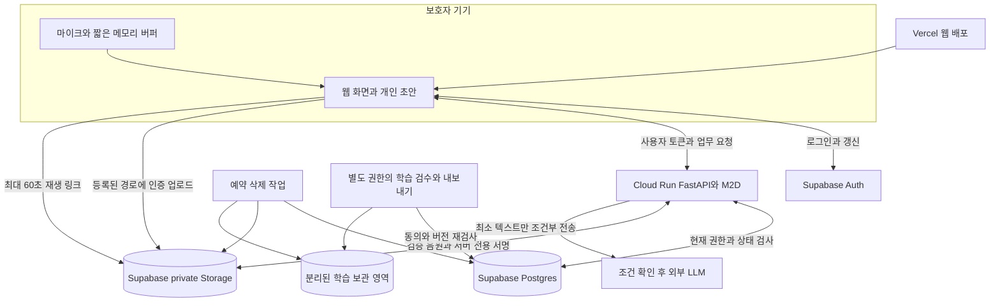

# 아기 울음 육아 도우미 보안 검토 및 설계

버전 1.1 · 검토일 2026년 9월 19일 · A 실행 태스크 추가 반영 · 대상 A 프런트엔드 담당과 B 백엔드 및 ML 담당

이 서비스의 보안 경계는 **아기 한 명의 공동 돌봄 공간**이다. 같은 아기의 활성 구성원에게만 확정 기록을 공유하고, 개인 초안·학습 참여·운영 권한은 별도로 통제한다. 음성에는 가족의 대화가 섞일 수 있고, 생활 기록은 아기와 가정의 일상을 드러내므로 원본 수집량과 외부 전송을 먼저 줄인다.

현재 Vercel·Supabase·Cloud Run 구성은 유지해도 된다. 실사용 전 우선 완성할 것은 ① 객체마다 아기와 현재 권한 검사 ② 업로드·재생·구독까지 이어지는 권한 회수 ③ 외부 LLM의 아동 개인정보 처리 조건 ④ 학습 사본과 백업을 포함한 삭제 ⑤ 관리자 키와 비용 통제다.

이 문서는 대화·명세·일부 학습 준비 코드를 읽은 **설계 검토 결과**다. 운영 서비스에 대한 침투 시험이나 보안 인증 결과가 아니다. 아래 위험은 확인된 설계상 검토 항목이며 실제 침해가 발생했다는 뜻이 아니다. 별도 [보안 인수 시험표](./SECURITY-ACCEPTANCE.md)에 구현 후 확인할 조건을, [A·B 보안 작업 연결표](./IMPLEMENTATION-HANDOFF.md)에 기존 담당 업무와의 연결을 정의했다.

## 1 검토 기준과 현재 상태

### 실제로 확인한 자료

| 자료 | 확인 범위와 적용 |
|---|---|
| 대화 아기울음 번역기 기능 구체화 | 자동 감지 우선, 전경 웹 세션, 행동·반응 라벨링, 공동양육, 후속 IoT 범위 |
| 대화 공동양육자 연동 난이도 및 공동양육 기능 설계 비교 검토 | Baby와 Membership 중심 공유, 작성자와 데이터 귀속 분리, 탈퇴·동의 구분 |
| 대화 서버 비용 검증 | FastAPI와 M2D를 Cloud Run에서 실행, Supabase Auth·DB·Storage 사용 |
| 대화 팀원과 API 계약 확정하기 | 검토 중 생성된 README와 OpenAPI 1.0.0 확인. A와 B의 책임·오류·직접 접근 경계 |
| PRD v2 및 기능명세 v2 | 본문·표·Word 주석. F01~F20, 특히 F02·F03·F14~F20, 데이터·API·운영 규칙 |
| 내가 맡을 일 B 실행 태스크 v2 | B-01~B-13의 구현 순서와 보안 책임 |
| 윤정이가 맡은 일 A 실행 태스크 v2 | A-01~A-11, Next.js·TanStack Query·브라우저 오디오·직접 업로드·통합 시험 책임 |
| 로컬 v1.1 문서와 M2D 학습 계획 | 이전 의사결정과 연구/서비스 경계 확인 |
| 학습 준비 코드 일부 | 가중치 해시, weights_only 로딩, 외부 코드 다운로드 방식의 정적 확인 |

v2 본문과 최신 팀 계약을 현재 기준으로 삼았다. 과거 대화의 6자리 초대 코드 제안, OWNER의 타인 기록 편집을 미루자는 제안은 v2에서 채택한 이메일 지정 초대·수정 이력 보존 규칙을 대체하지 않는다. A-03과 최종 대조한 계약에 맞춰 전환 전 미저장 입력 처리와 전환 후 로컬 초안 폐기를 9절에 명시했다. 첨부 문서의 구현 체크리스트는 검토할 요구사항으로 사용했으며, 이번 요청을 구현·배포 지시로 확대하지 않았다. 원본 문서와 다른 작업의 파일은 변경하지 않았다.

프로젝트의 `sources/`는 검토 시 비어 있었다. Manyfast 프로젝트 읽기에서는 제목은 있었으나 PRD·요구사항·기능 본문이 빈 상태로 반환되어 설계 근거로 사용하지 않았다. 현재 작업공간에서 확인한 실행 코드는 학습 준비 관련이며, 운영 FastAPI·RLS·클라우드 설정을 검증한 상태는 아니다.

### 이미 잘 정해진 사항과 이번 보완

| v2와 팀 계약의 기존 결정 | 이번에 구체화할 보안 규칙 |
|---|---|
| 아기 멤버십 기반 접근, 작성자 전용 초안 | 객체 연결의 동일 아기 제약, API와 DB 권한의 실제 적용 경로 |
| 지정 이메일·24시간·일회용 초대 | 256비트 토큰, 초대 발급 재인증, 경쟁 수락·유출·로그 방지 |
| private Storage, 재생 링크 최대 60초 | 서명 권한 서버 전용, 클라이언트의 장기 링크 직접 발급 차단 |
| 해제 이후 신규 접근 차단 | 기존 JWT, 진행 중 업로드·작업, 구독 권한 캐시의 처리 |
| 최소 LLM 전송, store false | 실제 아동 개인정보 전송을 여는 제공자 조건과 서버 측 차단 |
| 동의 철회·삭제·학습 계보 | 내보내기 중 철회, 만료, 작업 실패, 복원 후 재등장 방지 |
| 비밀키 서버 보관 | 업무 DB 역할과 광범위한 Storage 서버 키의 위험 구분 |

## 2 범위와 보호할 데이터

P0는 웹에서 `감지 시작 → 짧은 음원 분석 → 원인 후보와 확인 행동 → 행동·상태·반응 입력 → 라벨 확인 → 공동 기록과 다음 안내`까지다. 원인 후보는 의료 진단이 아니다. 네이티브 백그라운드 감지, 카메라, 가전 제어, 자동 재학습은 이번 보안 구현 범위에 넣지 않는다.

아래 등급은 내부 보안 분류다. 법률상 민감정보 해당 여부를 일괄 확정하는 표가 아니다.

| 분류 | 데이터 | 기본 처리 |
|---|---|---|
| 공개 가능 | 서비스 소개, 고정 캐릭터 자산, 승인된 일반 안내 | 개인정보와 연결하지 않은 정적 배포 |
| 개인 및 가정 정보 | 계정 이메일, 아기 별칭·생년월일, 구성원 관계, 수유·수면·기저귀 이력 | 아기별 격리, 필요한 화면에 필요한 필드만 제공 |
| 특히 보호할 원본 | 울음 및 주변 대화, 원문 메모, 건강 관련 서술, 미공유 초안 | 짧은 보관, 일반 로그 금지, 외부 전송 제한 |
| 연결된 파생 정보 | 특징값·임베딩·군집 ID, 맥락 스냅샷, 정규화 라벨, 학습 묶음 | 원본과 연결되는 동안 개인정보로 관리하고 삭제 전파 |
| 접근 비밀 | OTP, 초대 토큰, 사용자 세션, Storage 서명 URL, 서버 키 | 비공개, 짧은 수명·회수, 로그·분석 이벤트 제외 |

실명·주소·위치·연락처를 아기 프로필에 추가하지 않는다. 기존 생년월일은 월령 계산에 필요한 범위에서만 사용하고 LLM에는 보내지 않는다. 별칭·가명 ID·임베딩으로 바꿨다는 이유만으로 익명정보라고 부르지 않는다. 주변 성인의 말소리가 포함될 수 있음을 녹음 안내에 설명하고, 일상 대화 전체를 저장하는 기능은 만들지 않는다.

## 3 우선 위험과 대응

P0는 해당 기능에 실제 개인 데이터를 넣기 전에 해결할 항목이다. P1은 운영 확대 전 강화할 항목이다. 위험도는 사고가 일어날 확률을 측정한 값이 아니라 노출 시 영향과 공격 경로를 고려한 설계 우선순위다.

| ID | 위협과 구체적 발생 조건 | 우선순위 | 필요한 통제 |
|---|---|---|---|
| T01 | audio_id·episode_id·care_event_id만 바꿔 다른 아기 자료를 읽거나 연결 | P0 최우선 | 모든 객체의 현재 권한, 동일 baby_id, DB 복합 참조 제약 |
| T02 | 해제된 구성원이 기존 JWT·파일 링크·구독을 계속 사용 | P0 최우선 | DB 현재 멤버십, 서버 전용 링크 발급, 구독 회수, 진행 작업 재검사 |
| T03 | 이메일·초대 링크 탈취로 새 구성원 추가 또는 계정 장악 | P0 높음 | 검증 이메일 결합, 단일 사용, 재인증, 시도 제한 |
| T04 | 자연어 원문·오디오·프롬프트가 LLM이나 오류 수집 도구에 불필요하게 전송 | P0 최우선 | 전송 허용 조건, 최소 입력, 로그 제거, 공급자 보관 검토 |
| T05 | 메모에 지시문·스크립트를 넣어 라벨·화면·다른 사용자 데이터에 영향 | P0 높음 | LLM 도구 권한 없음, 출력 검증·사용자 확인, 텍스트 렌더링·CSP |
| T06 | 위장 음원·초대량 디코딩·외부 URL로 서버 자원이나 내부망 접근 | P0 높음 | 실제 파일 검증, 로컬 입력만 처리, 시간·메모리 제한 |
| T07 | 삭제 뒤 스냅샷·묶음·로컬 학습 사본·백업에서 자료 재등장 | P0 최우선 | 데이터 계보, 삭제 작업, 원본 및 파생물 검사, 복원 전 삭제 재적용 |
| T08 | 공개 분석 API 반복 호출로 비용 증가와 정상 이용 중단 | P0 높음 | 인증 전 중량 작업 금지, DB 기반 할당량·동시 실행 제한 |
| T09 | service_role 유출, 운영자 과다 권한, 공개 미리보기 환경에 실제 데이터 | P0 최우선 | 키·환경·직무 분리, 운영 MFA, 비밀 탐지, 최소 권한 |
| T10 | 가중치·의존 코드 변경, 학습 라벨 오염, DEMO 자료의 학습 혼입 | P0/P1 | 해시·버전 고정, 출처·동의 검수, 데이터 그룹 분리, 배포 승인 |

UUID는 식별자를 추측하기 어렵게 만들 뿐 권한 검사를 대신하지 않는다. 객체별 권한 검사를 해야 한다는 원칙은 [OWASP API1](https://api-security.owasp.org/editions/2023/en/0xa1-broken-object-level-authorization/)과 일치한다.

## 4 시스템 경계



브라우저와 사용자 입력은 신뢰하지 않는다. LLM의 출력도 신뢰하지 않는다. 클라우드 제공자의 저장소 암호화는 접근 권한을 대신하지 않는다. 서버가 분석을 위해 내용을 처리하므로 종단간 암호화를 제공한다고 표시하지 않는다.

팀 계약대로 브라우저의 업무 테이블·RPC 직접 접근 목록은 비워 둔다. Auth, 허가된 Storage 업로드·재생, 검증된 변경 신호만 직접 연결한다. 업무 조회·변경·동의·초대·확인 저장은 FastAPI를 통한다. 모든 통신은 HTTPS, DB 연결은 인증서 검증을 포함한 TLS를 사용한다.

## 5 인증과 세션

### 로그인

Supabase 이메일 OTP를 유지한다. 기본 설계값은 재발송 간격 60초, 검증 실패 5회 후 새 코드 요청, 계정·IP별 추가 제한이다. 제공자가 이 값을 지원하는지 확인하고 실제 설정을 시험한다. 로그인 화면의 제한만으로 제공자 Auth API 직접 호출을 막았다고 판단하지 않는다. OTP 본문·인증 토큰은 자체 로그에 남기지 않는다.

리디렉션 주소는 개발·시연·실사용 환경별로 정확히 등록한다. 운영 환경에서 임의 return URL이나 모든 preview 도메인을 허용하지 않는다. 비로그인 응답으로 가입 여부나 참여 아기를 노출하지 않는다. CAPTCHA는 남용 발생 시 인증 제공자 설정에서 추가하며 초대 토큰 검사를 대신하지 않는다.

### API 검증 순서

1. 예상 프로젝트의 JWT 서명·허용 알고리즘·issuer·audience·만료·subject를 검증한다. 단순 decode는 인증이 아니다.
2. 서명키는 고정된 프로젝트 JWKS에서 가져오고 갱신·키 교체를 지원한다. 요청의 임의 jku·키 URL은 사용하지 않는다.
3. 사용자 차단 및 회수된 session_id를 확인한다.
4. DB에서 대상 아기 상태와 현재 멤버십을 읽는다. JWT 속 OWNER나 사용자 수정 가능 metadata를 권한 근거로 쓰지 않는다.
5. 객체·행위·필드별 권한을 검사하고 같은 트랜잭션에서 작업한다.

JWT 검증은 [Supabase JWT 문서](https://supabase.com/docs/guides/auth/jwts)를 기준으로 실제 프로젝트의 서명 설정과 맞춘다. 새 비대칭 키 구성을 기본안으로 하며 기존 설정을 확인 없이 바꾸지 않는다.

### 세션 보관과 중요한 작업

신규 제안은 access token 15분 수명, 브라우저 탭 세션 저장소를 사용하는 Supabase 저장 어댑터다. 영구 localStorage 로그인을 기본으로 두지 않는다. 이 방식도 JavaScript에서 토큰을 읽을 수 있으므로 XSS에 안전한 저장소라고 설명하지 않는다. 사용 중 갱신, 새로고침, 다중 탭, 재로그인 경험은 A가 실기기로 확인한다.

로그아웃은 로컬 마이크·메모리·캐시를 바로 정리하면서 현재 session_id 회수를 서버에 기록하고 Supabase 세션도 종료한다. 네트워크 응답을 기다리느라 로컬 녹음을 계속하지 않는다. API와 Storage 정책의 공통 접근 검사에서 회수된 세션을 거부한다. `revoked_sessions`는 제공자 refresh 세션 종료가 확인되고 마지막으로 발급될 수 있는 access token의 수명이 끝날 때까지 유지한다. 제공자 회수가 실패하면 먼저 만료시키지 않고 재시도한다. 네트워크 단절로 서버 회수를 못 했으면 로컬 로그아웃과 서버 회수 완료를 구별한다.

새 구성원 초대, 전체 아기 삭제, 계정 이메일 변경, 공통 학습 활성화에는 최근 5분 이내의 새 OTP 확인을 요구한다. 단순 access token 갱신을 재인증으로 인정하지 않는다. 서버가 발급하는 일회용 재인증 증명은 사용자·세션·작업·대상 아기에 결합한다. 신규 `REAUTH_REQUIRED` 오류와 재인증 API는 팀 OpenAPI에 추가할 계약 항목이다. 운영·클라우드·GitHub 계정은 MFA를 필수로 한다.

## 6 아기와 객체 권한

### 권한표

| 동작 | OWNER | CAREGIVER | 해제된 구성원 | 운영 및 학습 검수자 |
|---|---|---|---|---|
| 같은 아기의 확정 기록·분석 조회 | 허용 | 허용 | 거부 | 역할만으로 허용하지 않음 |
| 자신의 미확인 초안 | 본인만 | 본인만 | 아기 접근은 거부 | 기본 거부 |
| 타인의 미확인 초안 | 거부 | 거부 | 거부 | 기본 거부 |
| 개인 알림 설정·미루기·확인 상태 | 본인만 | 본인만 | 아기 접근은 거부 | 기본 거부 |
| 본인 확정 기록 수정·삭제 | 허용 | 허용 | 별도 본인 기여 삭제 요청 | 기본 거부 |
| 타인 확정 기록 수정·삭제 | v2대로 허용, 최초 작성자·수정자·재확인 보존 | 거부, 후속 관찰만 | 거부 | 기본 거부 |
| 프로필·초대·구성원·전체 삭제 | 재인증 조건에 따라 허용 | 거부 | 거부 | 일반 운영권한으로 불가 |
| 본인 학습 동의 철회·삭제 요청 조회 | 허용 | 허용 | 본인 이력만 허용 | 대리 변경 금지 |
| 학습 묶음 내보내기 | 보호자 역할로 불가 | 불가 | 불가 | 별도 승인된 검수 범위만 |

OWNER는 서비스의 관리 역할이며 법정대리인 인증을 뜻하지 않는다. 실제 행동한 사람, 기록한 사람, 수정한 사람, 라벨 확인자를 분리한다. 대리 입력에 이름이 등장해도 자동으로 계정을 연결하지 않는다.

### 서버가 강제할 불변조건

```text
일반 접근 허용 = 인증 유효 AND 세션 미회수
              AND Baby.status = ACTIVE
              AND Membership(user, baby).status = ACTIVE
              AND 해당 객체와 작업의 추가 권한 충족

미확인 초안 접근 = 일반 접근 허용 AND draft.author_id = 인증 사용자
객체 연결 허용 = 연결되는 모든 객체의 baby_id가 동일
학습 적격 = 서비스 접근 권한과 별도로 동의·출처·버전·검수 조건 충족
```

AudioAsset처럼 아기 ID가 상위 사건에 있는 객체는 서버에서 사건을 따라 아기를 확인한다. 구현 시 각 종속 테이블에 baby_id를 두고 `(baby_id, parent_id)` 복합 외래키로 연결 무결성을 강제하는 안을 권한다. 단독 UUID 외래키만으로 서로 다른 아기 연결을 허용하지 않는다.

created_by·author_id·recipient_user_id·confirmed_by·role·status·retention_until·execution_token·검수 적격 여부는 일반 입력에서 수정할 수 없다. Pydantic 입력 허용 목록과 DB 제약을 함께 둔다. 사용자에게 반환하는 출력 스키마에서는 내부 토큰·키·초대 해시·불필요한 타인 이메일·내부 모델 점수를 제외한다. OWNER의 지정 이메일 초대 관리처럼 필요한 경우만 목적에 맞는 이메일을 반환한다.

조회 필터·검색·집계·페이지 cursor·유사 사례·변경 조회도 같은 권한을 적용한다. cursor와 idempotency key를 바꾸어 다른 아기 응답을 얻을 수 없어야 한다. 멱등 응답 반환 전에도 현재 권한과 삭제 상태를 다시 확인한다. 최신 계약의 준비 패턴·근거 기록은 공유하지만 알림 켜기·미루기·이번 끄기·확인 여부는 수신자 개인 값이다. 같은 아기 OWNER라도 타인의 개인 설정을 조회·변경하지 못한다.

### DB와 RLS의 구체적 역할

브라우저 `anon`·`authenticated`의 업무 테이블 GRANT와 공개 RPC 실행 권한을 제거한다. Storage 정책에 필요한 제한된 권한 검사 함수만 노출한다. 노출 스키마의 테이블은 RLS를 켜고, 뷰·집계·함수에도 우회 경로가 없는지 시험한다. GRANT와 RLS는 각각 설정해야 한다. [Supabase RLS](https://supabase.com/docs/guides/database/postgres/row-level-security)

업무 API의 DB 접속은 테이블 소유자가 아니고 BYPASSRLS도 없는 별도 `baby_app` 역할을 권한다. FastAPI가 검증한 subject·session을 트랜잭션 범위에만 설정하고 RLS가 이를 읽는다. 커넥션 풀에서 다음 사용자에게 인증 문맥이 남지 않도록 `SET LOCAL` 또는 동등한 트랜잭션 한정 설정을 사용한다. 이 역할에는 DDL·임의 역할 전환·일반 관리 권한을 주지 않는다. SQL은 매개변수 바인딩을 사용한다. 이 RLS는 앱의 조회 범위 누락에 대한 방어이며, 인증 문맥을 설정할 수 있는 서버 자체의 장악까지 막아 주는 독립 인증 장치로 설명하지 않는다.

Membership 조회의 RLS 재귀를 피하도록 권한 검사 함수와 테이블 정책을 검토한다. SECURITY DEFINER 함수가 필요하면 고정 search_path, 스키마가 명시된 참조, 최소 소유자 권한, 제한된 EXECUTE, 동적 SQL 금지를 적용한다. 사용자 임의 ID를 받아 권한을 대리 확인해 주지 않는다. 중요 변경은 검증된 함수와 트랜잭션으로 좁힌다.

Storage 서명·관리처럼 Supabase secret/service_role을 쓰는 경로는 RLS를 우회할 수 있다. 해당 키가 서버에 있다는 이유로 최소 권한이 달성됐다고 보지 않는다. 전용 Storage 모듈로 사용처를 제한하고, 입력 객체 ID에서 서버가 조회한 경로만 받는다. 일반 업무 CRUD를 그 키로 일괄 처리하지 않는 것이 목표다. 불가피하게 우회하는 구현은 개별 경로·권한 검사·시험을 명시한다.

## 7 초대와 공동양육 해제

초대 토큰은 CSPRNG 32바이트를 URL 안전하게 인코딩하고 서버에는 SHA-256 해시만 저장한다. 24시간 만료, CAREGIVER 역할만 부여, 재발급 시 이전 PENDING 취소를 유지한다. 수락 시 인증 제공자가 확인한 현재 이메일을 사용하고, 요청 본문의 이메일을 믿지 않는다. 이메일 비교는 제공자의 정규화와 일치시켜 점·플러스 주소를 임의로 합치지 않는다.

초대 화면에는 아기 기록을 넣지 않고 추적 스크립트도 제외한다. 토큰을 URL fragment로 전달하는 안을 우선하며 초기 화면이 읽은 뒤 주소에서 제거한다. query 전달이 필요하면 웹 서버·분석 도구의 URL 로그까지 제거한다. `Referrer-Policy: no-referrer`를 적용한다. 로그인 리디렉션에 토큰을 덧붙이지 말고 필요한 동안 현재 탭 메모리에만 보관한다. 브라우저를 닫았으면 원래 링크를 다시 열게 한다.

수락 트랜잭션은 초대 행을 잠그고 만료·취소·토큰 해시·검증 이메일·공유 범위 수락·활성 중복을 검사한 후 멤버십 생성과 ACCEPTED 전환을 함께 커밋한다. 두 요청이 동시에 수락해도 하나만 생성한다. 공격자가 미리 만든 analysis_id 등을 자기 자원으로 바인딩하는 상황도 같은 소유·요청 해시 검증으로 막는다.

구성원 제거 시 멤버십 상태, 해당 사용자의 감지 세션, 업로드 허가, 진행 작업의 권한 판정에 쓰는 revision을 함께 갱신한다. 권한 확인과 저장 사이에 해제가 끼어드는 경쟁은 관련 행 잠금 또는 version 조건으로 직렬화한다. 해제 후 늦게 끝난 분석·LLM 결과는 저장 조건을 다시 검사하고, 사용자에게 본문을 돌려주지 않는다. 해제 이전에 확정된 공유 기록은 남긴다.

404는 비구성원이나 타인 초안의 존재 은폐, 403은 활성 구성원의 역할 부족, 401은 인증 문제로 사용한다. 409 충돌 응답의 최신 값도 현재 읽을 수 있는 범위에서만 반환한다. 삭제 진행·완료에 관한 상세 상태는 요청자에게만 제공한다.

## 8 음원 업로드와 재생

### 업로드 순서

1. 서버가 episode의 아기·구성원·서비스 처리 동의를 확인한다. 자동 감지 입력은 현재 감지 세션도 검사한다. 직접 녹음·파일 입력에는 자동 감지 세션을 요구하지 않는다.
2. upload_id, uploader_id, 정확한 object_key, 허용 크기, 15분 만료를 DB에 기록한다. 저장 경로는 난수 ID로 만들고 이메일·별칭·생년월일을 넣지 않는다.
3. 브라우저가 사용자 JWT로 private Storage에 직접 올린다. signed upload URL은 P0 기본안으로 사용하지 않는다. `upsert=false`, 임의 경로·클라이언트 삭제·교체를 거부한다.
4. Storage RLS가 현재 멤버십·아기 상태·업로더·미만료 업로드 허가·정확한 경로를 검사한다. 업무 테이블 전체를 읽을 수 있는 권한을 이 때문에 브라우저에 주지 않는다.
5. complete API가 실제 파일 크기·컨테이너·디코딩·길이·서버 계산 체크섬과 현재 권한을 재검사한다. 선언한 MIME·길이·해시만으로 READY로 바꾸지 않는다.
6. 검증을 마친 객체는 불변으로 사용한다. 재시도는 같은 미완료 객체에 한정하고, 확정 객체를 바꾸려면 새 audio_id를 발급한다.

기존 한도는 자동 구간 최대 20초, 직접 녹음 최대 30초, 파일 최대 60초·25MB다. 검토한 OpenAPI의 `UploadGrant.max_bytes` 상한은 **25,000,000바이트**이며 Storage bucket과 A의 사전 검사도 이 상수에 맞춘다. 6MB 초과와 불안정 연결에는 기존 TUS 계약을 적용하되, 재개·완료 중 권한 회수·만료 검사를 실제 환경에서 통과시킨다. 이미 진행 중이던 바이트 전송이 끝나더라도 complete를 거부하고 고아 파일을 정리한다. 업로드 연결을 즉시 물리적으로 끊을 수 있다고 약속하지 않는다. [Supabase 업로드 권한](https://supabase.com/docs/guides/storage/security/access-control), [재개 업로드](https://supabase.com/docs/guides/storage/uploads/resumable-uploads)

### 디코더와 추론

허용한 오디오 컨테이너·코덱만 처리하고 비디오·재생목록·압축파일·외부 참조를 거부한다. FFmpeg에는 앱이 만든 로컬 파일이나 파이프만 전달한다. 사용자 파일명으로 명령을 조립하거나 shell을 호출하지 않는다. 외부 URL을 받아 내려받는 입력 경로를 만들지 않는다. 디코더 프로토콜 제한과 네트워크 기능 제한을 적용하고 메타데이터·커버 이미지는 분석 및 재생용 출력에서 제거한다.

디코딩 결과는 16kHz mono와 최대 60초의 실제 샘플 수로 제한한다. 압축 파일 크기가 작아도 디코딩 시간·메모리·출력 바이트가 한도를 넘으면 중단한다. 별도 자식 프로세스의 기한·자원 한도를 두고, 처리 종료·실패 시 임시 파일을 정리한다. 비정상 파일을 공개 악성코드 검사 서비스에 보내 개인정보를 다시 유출하지 않는다. [OWASP 파일 업로드 지침](https://cheatsheetseries.owasp.org/cheatsheets/File_Upload_Cheat_Sheet.html)

### 재생과 권한 회수의 정확한 보장

P0는 v2의 **서버 발급, 최대 60초 서명 URL**을 유지한다. 재생 동의가 켜진 READY 음원만 발급하며 임시 분석 음원에는 발급하지 않는다. 반환 응답은 `Cache-Control: no-store`로 하고 URL은 로그·분석 이벤트·DB·알림에 저장하지 않는다.

브라우저 사용자에게 오디오 bucket의 포괄적 SELECT·서명 생성 권한을 주지 않는다. 그렇지 않으면 앱의 60초 제한을 우회하는 경로가 생길 수 있다. 직접 파일 목록 조회·download·서명 API·서버 발급 링크를 각각 시험한다. 업로드만 필요한 기본 경로에는 INSERT만 허용하는 것이 출발점이다.

구성원 해제·로그아웃 이후 **새 재생 링크 발급은 거부**한다. 이미 발급한 링크는 남은 유효시간 동안 새 다운로드를 시작하는 데 쓰일 수 있다. 만료 전에 시작한 전송과 이미 내려받은 사본은 회수되지 않는다. 따라서 “60초 뒤 기기의 모든 파일이 사라짐” 또는 “즉시 모든 접근 회수”로 안내하면 안 된다. [Supabase 비공개 파일 전달 방식](https://supabase.com/docs/guides/storage/serving/downloads)

즉시 재생 권한 회수가 필수인 공개 운영 조건을 선택한다면, 서명 URL 대신 매 요청·Range마다 권한을 확인하는 인증된 서버 스트리밍으로 계약을 변경한다. 이미 전달된 바이트는 그 방식에서도 회수할 수 없다. 이는 P0 기본 계약을 바꾸는 강화안이며 현재 구현됐다는 뜻이 아니다.

## 9 마이크와 브라우저 및 변경 동기화

자동 감지는 사용자의 명시적 시작 뒤에만 실행한다. 감지 전 3초 버퍼와 필요한 짧은 구간만 메모리에 둔다. 브라우저 DB·서비스워커 캐시·복구 파일에 원시 음원을 지속 저장하지 않는다. 페이지 숨김·로그아웃·아기 전환·권한 상실 시 트랙을 stop하고 버퍼를 비운다. 복귀 후 자동 녹음 재개 없이 재개 버튼을 보여준다. UI가 멈추면 서버 heartbeat 30초 만료로 해당 자동 감지 세션의 새 업로드 허가를 막는다. 직접 녹음·파일 입력의 별도 권한 검사와 혼동하지 않는다.

캐시 키는 팀 계약대로 `(user_id, baby_id, resource, parameters)`다. 계정·아기 전환 시 진행 요청을 취소하고, 취소되지 않은 응답은 요청 당시 범위를 비교해 폐기한다. 민감한 API 응답·오디오·정규화 원문에는 브라우저·CDN의 공유 캐시를 사용하지 않는다. 뒤로 가기와 페이지 복원 때 권한을 다시 확인한다.

A-03과 최종 대조한 팀 계약에 따라 **전환 후 이전 아기의 로컬 초안은 폐기**한다. 미저장 입력이 있으면 전환 전에 계속 작성·개인 초안 저장 후 전환·버리고 전환을 고르게 한다. 저장을 선택하면 원래 아기의 작성자 전용 초안 API가 성공한 뒤 전환하며, 실패하거나 권한을 잃었으면 다른 아기에 대신 저장하지 않는다. 성공 응답이 유실되면 같은 요청 키로 확인한다. 이전 아기로 돌아올 때는 현재 멤버십을 확인한 후 서버의 본인 초안만 다시 조회한다. 로그아웃·계정 변경·권한 해제 시에는 관련 미전송 내용을 자동 저장·재전송하지 않고 폐기한다. 브라우저에 내려간 내용을 악의적인 클라이언트에서 강제로 지울 수 있다는 보장은 하지 않는다.

### A의 웹 기술 구성에 적용할 규칙

- **Next.js App Router:** P0 업무 데이터는 브라우저에서 사용자 Bearer로 FastAPI를 호출한다. 서버 렌더링에는 공개 화면 구조만 두는 안을 기본으로 한다. A가 별도 DB 관리 키를 써서 Server Action·Route Handler로 권한 경로를 만들지 않는다. 이후 개인 자료 SSR을 추가하면 요청별 권한 확인, 최소 반환 필드, 비공개 응답의 `no-store`, HTML·RSC 전달 내용 검사를 먼저 한다. Server Action 역시 외부에서 호출 가능한 서버 진입점으로 취급한다. [Next.js 데이터 보안](https://nextjs.org/docs/app/guides/data-security)
- **TanStack Query:** 민감한 쿼리·mutation과 미전송 입력을 localStorage·IndexedDB에 영구 보관하거나 오프라인 자동 재전송하지 않는다. 계정 전환 시 QueryClient를 정리하고, 진행 중 optimistic UI도 새 범위에 섞이지 않게 한다. SSR을 추가할 때 서버 전역 QueryClient를 공유하지 않고 요청마다 만든다. [TanStack Query 서버 렌더링](https://tanstack.com/query/latest/docs/framework/react/guides/ssr)
- **React Hook Form·Zod:** 길이·필수값·허용 코드 검사는 입력 도움이다. OWNER 여부, 작성자, 동의, 최종 라벨과 서버 소유 필드는 B가 별도로 검증한다. 숨긴 버튼이나 disabled 필드를 권한 통제로 간주하지 않는다.
- **TUS·오디오:** 원본 파일명·기기 이름을 업로드 메타데이터에 넣지 않는다. 재개 정보는 사용자·아기·audio_id·upload_id에 결합해 탭 메모리에서 관리하고 전환·회수 시 종료한다. 반환된 업로드 주소도 허용된 HTTPS Storage 출처인지 검사한 뒤 JWT를 붙인다. 재생 종료·전환 때 Blob URL을 revoke하고 AudioContext·AudioWorklet·트랙과 이벤트 핸들러를 함께 정리한다.
- **오류 수집·브라우저 검수:** 공개 `NEXT_PUBLIC_*`에는 API 주소·Supabase publishable key 등 공개값만 둔다. 사용자 원문·폼값·음원·토큰을 console·분석 이벤트·세션 재생 도구로 보내지 않는다. Playwright 영상·스크린샷·trace·HAR는 합성 계정과 합성 자료로만 만들고 실제 로그인 상태 파일은 Git·공유 보고서에 넣지 않는다.

원문·LLM 출력은 텍스트로 렌더링하고 HTML·외부 이미지·임의 링크로 실행하지 않는다. CSP는 script nonce/hash와 제한된 connect-src·media-src를 사용한다. nonce를 선택하면 요청마다 새 값을 만들고 동적 렌더링을 적용하며 같은 nonce가 든 HTML을 CDN에 공유 캐시하지 않는다. WASM·AudioWorklet에 필요한 예외만 실기기 시험 후 좁혀 추가한다. 운영 환경의 일반 unsafe-eval이나 임의 CDN 허용으로 해결하지 않는다. `object-src 'none'`, `base-uri 'self'`, `frame-ancestors 'none'`, `Permissions-Policy: microphone=(self), camera=(), geolocation=()`를 기준으로 한다. 앱 iframe 사용이 필요해지면 그때 출처를 명시한다. [Next.js CSP 적용 조건](https://nextjs.org/docs/app/guides/content-security-policy)

CORS는 정확한 환경 도메인만 허용한다. CORS는 인증이 아니므로 브라우저 밖의 API 호출은 JWT·권한·할당량으로 막는다. Bearer 기반 API를 유지하며 인증 쿠키/BFF를 도입할 때는 CSRF 토큰·Origin 검사·SameSite·HttpOnly 설계를 함께 추가한다. 사용 중인 세션 방식을 확인하지 않고 HttpOnly 보호가 된다고 주장하지 않는다.

### Realtime의 추가 조건

Supabase Broadcast의 채널 권한은 연결 동안 캐시될 수 있어 DB 멤버십 변경만으로 기존 구독을 즉시 끊는다고 가정할 수 없다. [Supabase Realtime 권한 갱신](https://supabase.com/docs/guides/realtime/authorization)

P0 보안 기본 경로는 팀 계약의 changes 조회와 창 복귀 재조회다. 5초 폴링을 기본으로 하되 p95 5초 반영 목표는 전송시간까지 측정하며 필요하면 간격을 조정한다. Realtime을 켤 때는 다음 모두를 만족해야 한다.

- 공유 baby 채널 하나에 계속 방송하면서 클라이언트가 알아서 나가길 기대하지 않는다.
- 현재 활성 수신자를 서버가 확인하여 **멤버십별 채널**로 최소 변경 신호만 보낸다. 채널 가입도 해당 사용자·활성 멤버십으로 검사한다. 사용자의 broadcast 쓰기와 presence는 기본 거부한다.
- LEFT·REVOKED 이후 그 멤버십 채널에 새 신호를 발행하지 않는다. 대기 중 신호는 발행 시 재검사하고, 해제와 발행을 직렬화한다. 재가입은 새 membership_id를 사용한다.
- 신호에는 원문·파일 URL·분석 본문·초안 내용을 넣지 않는다. 실제 데이터는 매번 FastAPI로 재조회한다.
- 해제 전에 이미 전송된 신호의 지연 도착과, 해제 뒤 새로 발행하는 신호를 구별해 시험한다. 회수를 입증하지 못하면 Realtime을 끄고 폴링으로 동작한다.

이는 공유 기록 기능의 축소가 아니라 변경 전달 방식에 대한 보안 조건이다.

## 10 외부 LLM과 라벨 무결성

### 실제 아기 데이터 전송을 여는 조건

OpenAI 공식 아동 관련 지침은 13세 미만 또는 적용되는 디지털 동의 연령 미만 아동의 개인정보를 처리하기 전에 API의 Zero Data Retention을 적용하라고 안내한다. 데이터 제어 문서는 일반 API의 악용 모니터링 보관과 응답 저장을 구분한다. `store:false`를 ZDR 승인 또는 모든 보관의 제거로 해석하지 않는다. [OpenAI 아동 관련 API 지침](https://developers.openai.com/api/docs/guides/safety-checks/under-18-api-guidance), [데이터 제어](https://developers.openai.com/api/docs/guides/your-data)

이 서비스는 보호자가 사용하는 앱이지만 전송 내용의 정보주체는 영아일 수 있다. 이 적용 범위를 제공자와 확인하고, **본 설계는 실제 영아 개인정보 전송에 ZDR 조건을 보수적으로 적용**한다. 현재 계정의 승인·프로젝트 설정·선택 모델과 endpoint의 적격성은 확인되지 않았다.

서버 설정 `external_normalization_enabled`의 실사용 기본값은 false다. A가 전달한 DEMO 플래그만으로 이를 우회할 수 없다. 제공자 조건·아동 처리 근거·국외 이전·계약을 확인한 후 지정 환경에서만 켠다. 합성 예시의 LLM 시연은 별도 데모 환경과 고정된 합성 자료로 한다. 조건 확인 전에도 선택지 및 MANUAL 정리·확인 저장은 가능하다. 다만 이 상태를 v2의 실제 자연어 정규화 P0 완료로 보고하지 않는다.

### 전송 최소화와 출력 검증

전송은 해당 정리 대상 텍스트·선택 코드·라벨 사전·필요한 상대 시각 기준에 한정한다. 원시 음원, baby_id, 계정 ID·이메일, 전체 돌봄 이력, 생년월일, 오디오 후보와 추천을 붙이지 않는다. 개인정보가 직접 입력된 원문은 서버에서 마스킹하고 사용자가 전송 내용을 확인할 수 있게 한다. 마스킹만으로 익명화나 제공자 조건 충족이 완료됐다고 보지 않는다.

마스킹 때문에 원문 위치가 달라지면 서버가 원문과 전송문 사이의 코드포인트 매핑을 관리한다. LLM의 인용·span을 원문 좌표로 되돌려 실제 부분문자열과 확인한다. 인용 위치가 맞지 않는 결과는 확정하지 않는다.

NormalizerAdapter는 단일 요청의 추출기로만 동작한다. 도구 호출·MCP·웹 검색·DB 조회·파일 접근 권한을 주지 않는다. 사용자 지시문은 데이터 영역에 넣고 시스템 명령으로 실행하지 않는다. 출력은 JSON 구조, 허용 코드, 수량·단위·시간·원문 근거를 검사한다. 요청과 출력 크기 제한을 두고 실패 시 자동으로 무한 재시도하지 않는다. [OWASP LLM 주입 방어](https://cheatsheetseries.owasp.org/cheatsheets/LLM_Prompt_Injection_Prevention_Cheat_Sheet.html)

확정 저장에서는 input_revision·run_id·실행 토큰·현재 멤버십·연결 객체 버전을 검사한다. LLM은 권한·동의·실제 수행·의학적 원인을 확정할 수 없다. 보호자가 누른 최종 확인만 원자적으로 CareEvent·행동·관찰·라벨로 저장한다. 부정·계획·추측은 수행으로 바꾸지 않는다. `수유 후 잠듦`은 관찰이고 `배고픔 정답`은 아니다.

원문·프롬프트·응답 본문을 SDK tracing, APM, 오류 수집기, 개발 로그, CI fixture에 남기지 않는다. 요청 간 대화 상태를 공유하지 않는다. P0에는 provider file upload·conversation 저장·background 실행·도구를 추가하지 않고, 선택한 모델의 캐시·보관 예외도 출시 조건에 포함한다.

## 11 동의와 학습 데이터

기존 `SERVICE_PROCESSING`, `SHARED_USE`, `AUDIO_RETENTION`, `BABY_TRAINING`, `CONTRIBUTOR_TRAINING`을 유지한다. 마이크 권한은 이 동의를 대체하지 않는다. 외부 처리 안내·정책 버전과 법정대리인 동의 확인을 별도 이력으로 연결한다. 원본을 일시 처리하는 것, 재생용으로 보관하는 것, 학습용으로 복사하는 것을 화면에서 분리한다.

학습 가능 여부는 다음 모든 조건의 AND로 판정한다.

```text
아기 공통 학습 허용
AND 원본 제공자와 포함된 모든 작성·수정·확인 기여자의 목적별 동의
AND 데이터별 사용 권리 및 음원 보관·학습 복사 조건 충족
AND 라벨 확인 및 사람 검수 통과
AND 원본·라벨·동의 버전이 현재 버전과 일치
AND 삭제·철회·만료·미해결 충돌 없음
AND DEMO·STUB·출처 불명 자료 제외
```

재생 보관은 껐지만 학습은 켠 경우를 묵시적으로 허용하지 않는다. 기존 v2 조건을 보수적으로 적용해 P0의 오디오 학습은 원본 보관 및 별도 학습 복사 조건을 모두 충족할 때만 허용한다. 원문이 공개된 기록이라는 이유로 모든 기여자의 학습 동의를 대신하지 않는다. 동의 후 과거 자료까지 소급 포함하는 것도 기본 허용하지 않고 명시한 적용 범위를 확인한다.

TRAINING_CURATOR는 일반 보호자와 다른 권한이다. 검수할 후보의 최소 가명 자료만 접근하고 원문·이메일·초대 정보는 기본 내보내기에서 제외한다. raw text 수동 검수가 꼭 필요하면 별도 한시적 접근 이유·대상·만료·감사 기록을 남긴다. OWNER가 모든 가족의 학습 동의를 켜거나 운영자가 사용자 대신 동의할 수 없다.

학습 묶음은 source IDs·버전·모든 동의 revision·목적·체크섬·만료·가명 분할 그룹을 manifest로 고정한다. 내보내기 시작뿐 아니라 게시 직전, 다운로드 직전, 학습 실행 직전에 현재 유효성을 검사한다. 철회와 묶음 생성이 경쟁하면 철회한 버전이 포함된 묶음은 게시하지 않는다.

철회 시 묶음 INVALIDATED, 대기 학습 중지, 연결된 파일·특징·로컬 사본 삭제, 진행 학습 격리, 배포된 모델 영향 검토를 연결한다. 이미 학습된 가중치에서 특정 자료만 즉시 제거했다고 말하지 않는다. 모델 사용 중지·이전 버전 롤백·재학습 여부를 검토할 담당자와 이력을 둔다.

학습용 가명 ID와 사용자 원본 ID의 대응표는 별도 권한으로 보관한다. 동일 아기·가정·원본 파생 파일은 같은 평가 그룹에 둔다. 서비스 사용자 자료를 개인 iCloud·공유 드라이브·개발용 Git·개인 AI 도구로 자동 동기화하지 않는다. 실사용 학습 파일을 로컬로 반출하면 승인된 암호화 저장공간, manifest, 만료, 삭제 확인까지 관리 대상에 넣는다.

## 12 보관과 삭제

### 보관 기본값

| 데이터 | 수명 또는 만료 기준 | 처리 |
|---|---|---|
| 감지 전 주변 음성 버퍼 | 최근 3초, 현재 메모리 | 지속 교체, 중지·숨김·전환 시 폐기 |
| 보관 미동의 임시 음원 | 분석 끝난 즉시 정리, 수신 후 최대 1시간 | 재생 금지, 미완료·거절·고아 업로드 포함 |
| 선택 보관 음원 | 수신 시점 기준 기본 7일 | 재생해도 만료가 연장되지 않음 |
| 학습 음원 사본·묶음 | 생성 시점 기준 기본 30일 또는 철회·삭제 중 먼저 도래한 때 | 원본과 별도 추적, 무단 복사로 연장 금지 |
| 미확인 원문 초안 | 새 제안 최대 7일, 사용자 삭제 시 즉시 접근 제외 | 만료 안내, 일반 확정 기록과 분리 |
| 확정 기록·라벨·분석·맥락 | 서비스 목적이 유지되는 동안, 삭제 요청 시 관련 자료 함께 제거 | 불필요한 원문 복제 금지, 장기 미사용 정책 별도 확정 |
| 멱등성 자료 | 팀 계약 최소 7일 | 요청 해시·리소스 참조 중심, 원문·응답 사본 제외 |
| 운영 오류 로그 | 새 제안 30일 | 개인정보 본문 없음, 접근 권한 제한 |
| 개인정보 접속 기록·동의 증빙 | 적용 법령과 처리 범위에 따른 기간을 출시 설정에서 확정 | 최소 식별자·행위·시각, 본문 보관 근거로 사용 금지 |
| 백업·제공자 사본 | 실제 서비스별 계약과 플랜에서 확인한 기간 | 만료와 복원 통제까지 안내, 확인 전 삭제 완료 보장 금지 |

위 기간은 v2 값과 명시한 신규 제안을 구분한 개발 기준이다. 법정 보관 기간을 추정한 표가 아니다. 원문 초안 7일은 팀 계약에 추가할 수명 규칙이다. 처리 목적이 끝난 자료는 기간이 남았다는 이유로 계속 보유하지 않는다.

### 삭제 상태와 실행

Baby는 `ACTIVE → DELETING → DELETED`를 유지한다. DeletionJob은 팀 계약의 상태값을 사용하되 즉시 접근 제외와 물리 정리 완료를 구분한다. 일부 실패 상태에서 아기를 ACTIVE로 되돌리지 않는다.

삭제 요청 트랜잭션에서 대상 접근을 막고 진행 작업의 유효성을 변경하며 내구성 있는 작업 행을 만든다. Scheduler가 호출하는 별도 Cloud Run Job이 그 행을 읽어 재시도한다. API 응답 후 메모리 background task에만 맡기지 않는다. 기본 점검 주기는 5분을 제안한다. 임시 파일은 종료 즉시 정리하고 미종료 자료는 45분부터 선제 정리하여 1시간 상한 위반을 탐지한다. 외부 장애로 상한을 지키지 못하면 위반 사건으로 기록하고 추가 수집 제한을 검토한다.

삭제 그래프는 다음 모두를 포함한다.

```text
음원 / 원문 / 확정 기록
 → 정규화 초안과 결과 / 라벨 / 행동 / 관찰 / 반응
 → 맥락 스냅샷 / 추천 / 요약 / 개인화 특징 / 검색 색인
 → 학습 후보 / 내보내기 묶음 / 학습 사본 / 로컬 특징
 → 애플리케이션 캐시 / 고아 업로드 / 임시 파일
```

원문 삭제 뒤 과거 스냅샷을 이유로 동일 내용을 보존하지 않는다. 사라진 근거는 SOURCE_DELETED와 최소 참조로 표시한다. 다른 구성원의 독립적인 기록을 함께 지우지 않되 삭제 대상 원문을 복사한 파생 항목은 정리한다. account 삭제도 별도 흐름으로 두며 마지막 OWNER 계정을 먼저 없애 아기 데이터가 고아가 되지 않게 한다. P0 소유권 이전이 없으므로 공간 삭제 또는 본인 기여 정리 경로를 먼저 완료한다.

Storage 객체 삭제는 제공자 파일 API를 사용한다. DB의 storage.objects 메타데이터만 지운 것으로 실제 파일 삭제가 완료됐다고 판정하지 않는다. 묶음 파일은 무효화만 하지 말고 접근도 차단하고 실제 사본 정리 결과를 확인한다.

완료 조건은 운영 저장소·파생물·관리되는 학습 사본의 정리 증거가 모두 있는 상태다. 백업 사본의 보존 종료와 외부 제공자 잔존 기간은 별도 필드로 추적하고 사용자에게 구별해 알린다. 백업 복원은 격리 환경에서 수행하고 삭제 tombstone·철회 이력을 먼저 재적용한 뒤 서비스에 연결한다. 복원 시험에는 삭제된 자료가 다시 조회되지 않는 검증을 포함한다.

## 13 한국 이용자와 아동 개인정보

한국 이용자 대상 출시를 가정한다. 실제 사업자·공개 국가·제공자 계약이 확정되지 않아 이 문서만으로 법 준수를 완료했다고 판정할 수는 없다. 다음은 해당 기능을 실사용으로 열기 전에 해소할 구체적 항목이다.

- 만 14세 미만 아동의 개인정보 처리에 동의가 필요한 경우 법정대리인 동의와 확인이 필요하다. OWNER·엄마·아빠 관계 표시와 이메일 OTP만으로 그 요건을 모두 확인했다고 처리하지 않는다. [개인정보 보호법 제22조의2](https://law.go.kr/LSW/lsLinkCommonInfo.do?chrClsCd=010202&lsJoLnkSeq=1020398521)
- 별도 GuardianConsent 기록에 아기·동의자·범위·고지 버전·확인 방법·확인 시각·최소 증빙 참조·철회를 둔다. 실제 확인 절차는 적용 법령에 맞게 정하고 확인되지 않은 실사용 아기 자료의 수집을 차단한다. 주민등록번호나 가족관계증명서를 기본 가입 필드로 추가하지 않는다.
- 건강 관련 메모가 포함될 수 있으므로 민감정보 처리 범위·별도 동의 또는 다른 법적 근거·접속 기록 보존 기준을 검토한다. 모든 울음 파일이 곧 법률상 생체인식정보라거나 모든 수유 기록이 동일한 민감정보라고 단정하지 않는다.
- 국외 이전은 저장 리전뿐 아니라 조회·처리위탁·보관을 포함해 판단한다. 법에는 별도 동의 외의 허용 근거도 있으므로 “무조건 체크박스 하나”로 처리하지 않는다. 선택한 근거와 필요한 고지·계약·보호조치를 문서화한다. [개인정보 보호법 제28조의8](https://law.go.kr/lsLinkCommonInfo.do?chrClsCd=010202&lsJoLnkSeq=1029331979)
- 개인정보 처리방침에는 실제 수집 항목·목적·보관·공유 범위·수탁자·국외 처리·삭제 및 철회 방법·문의 책임자를 기재한다. 해커톤 참여만으로 개인정보 처리가 면제된다고 가정하지 않는다.

제공자별로 처리 데이터, 저장 및 처리 국가, 해외 지원 접근, 재위탁, 학습 사용, 보관·삭제·백업, 사고 통지 조건을 적은 등록표가 필요하다. Cloud Run을 서울에 둔다고 Vercel·Supabase·LLM·오류 수집의 데이터 이동까지 국내로 한정되는 것은 아니다. 이 항목이 미확정이면 합성 자료 또는 사용 권리가 확인된 예시로 공개 시연하고 실제 이용자 자료 수집은 별도 출시 단계로 둔다.

## 14 서버 운영과 공급망 및 비용

### 권한과 배포

공개 FastAPI는 브라우저의 접근을 받되, 정적 최소 health 응답 외의 업무 경로는 반드시 인증한다. Cloud Run의 공개 ingress와 애플리케이션 인증을 구분한다. `/internal`이라는 경로명은 보안 경계가 아니므로 학습 내보내기와 정리 Job은 별도 실행 진입점·IAM으로 제한한다. P0의 학습 검수는 승인된 내부 명령을 기본으로 삼을 수 있다.

API 실행, 정리 Job, 학습 검수, 배포 CI의 서비스 계정을 나눈다. 각자 필요한 Secret Manager secret·DB 작업·Storage 영역만 허용하는 구성을 목표로 하고 project Owner·Editor를 일괄 부여하지 않는다. 지원하지 않는 세밀한 Storage 권한은 제한됐다고 표시하지 말고 광범위 키의 잔여 위험을 기록한다. [Cloud Run 서비스 실행 주체](https://docs.cloud.google.com/run/docs/securing/service-identity)

개발·시연·실사용의 DB·Storage·키·Auth redirect·CORS를 분리한다. Vercel preview와 외부 기여 PR CI에는 실제 서비스 키를 넣지 않는다. `.env`·음원·데이터셋·학습 묶음·불필요한 체크포인트는 Git 및 Docker 빌드 문맥에서 제외한다. 배포는 잠금 파일·이미지 digest·가중치 해시·전처리·라벨 버전을 고정하고 검증한 이전 묶음으로 롤백한다.

운영 서비스는 임의 사용자 가중치·pickle·모델 경로를 받지 않는다. 가중치는 신뢰한 배포 산출물만 사용하고 가능하면 비실행형 텐서 형식, PyTorch 사용 시 제한된 weights_only 로딩을 유지한다. 제한 로딩과 해시는 출처 신뢰·취약점 관리를 완전히 대체하지 않는다.

정적 코드 확인에서 `work/m2d-stage2/setup_stage2.py`는 M2D·MAE·일부 의존 커밋과 모델 해시를 고정하고 있다. 다만 `util/analyze_repr.py` 다운로드가 외부 저장소의 `master`를 가리킨다. 최초 취득 시 변경될 수 있으므로 다음 재현 환경 구축 전에 커밋·예상 해시를 고정해야 한다. 이 사실은 현재 학습 결과가 변조됐다는 증거는 아니다. 이번 검토에서는 학습 파일을 수정하거나 학습을 재실행하지 않았다.

### 요청량 기본안

아래는 제한된 초기 사용자 운영을 위한 신규 제안값이다. v2의 분석 45초·lease 60초, 정규화 20초·lease 30초, 인스턴스당 추론 1개는 유지한다. 실제 사용량과 오탐·재시도 비율을 보고 버전 관리하며 조정한다.

| 항목 | 초기 제안 | 강제 위치 |
|---|---|---|
| 분석 | 사용자 5회/분, 100회/일, 아기 200회/일 | DB의 원자적 할당량 예약 |
| 동시 실행 | 사용자·아기별 중량 작업 제한, 분석 아기당 1건 | DB lease와 유일 제약 |
| LLM 정규화 | 사용자 10회/분, 100회/일 | 외부 요청 전 서버 |
| 음원 | 사용자 미완료 업로드 3개, 예약 바이트 포함 하루 250MB | 업로드 허가 발급과 Storage 한도 |
| 초대 | 아기 5회/시간, 20회/일 | 서버, 재발급도 포함 |
| 일반 조회 | 사용자 120회/분부터 시작 | 폴링 포함, 화면 실제 호출량 확인 |

Cloud Run 여러 인스턴스가 공유하는 제한을 프로세스 메모리에만 저장하지 않는다. 기존 Postgres로 카운터·lease를 구현해 P0에 Redis를 추가하지 않는다. 재전송으로 같은 중량 작업을 중복 차감하지 않되 HTTP 자체의 남용 제한은 유지한다. 브라우저의 사용자 식별값과 임의 X-Forwarded-For를 신뢰하지 않는다.

인증·권한·크기·할당량을 검사한 다음 디코딩·추론·LLM을 실행한다. 전체 외부 호출 예산과 일일 한도, 비용 알림, 운영 중지 스위치를 둔다. 제공자 지출 알림이나 최대 인스턴스를 정확한 과금 차단 장치로 설명하지 않는다. 직접 Storage 업로드 비용도 따로 제한한다.

## 15 감사와 사고 대응

일반 로그는 request_id, 작업 종류, 결과 코드, 처리시간, 버전 중심이다. raw text·아기 별칭·이메일·OTP·Authorization·cookie·서명 URL·파일 본문·LLM 본문은 제외한다. 에러 객체와 HTTP 자동 계측에서도 같은 제거 규칙을 적용한다. 보안 접속 기록은 제한된 별도 저장소에 사용자 참조·객체 참조·행위·성공 여부·시각·정책 버전을 보존하고, 이 참조도 접근 통제한다.

감사 대상은 초대·수락·해제, 재인증, 권한 변경, 동의·철회, 재생 링크 발급, 삭제, 학습 내보내기, 운영자 한시 접근, 배포·키 교체다. 원문을 감사 테이블에 복제하지 않는다. 정리 Job 지연·1시간 임시 파일 잔존·비정상 다운로드·반복 403/404·LLM 비용 급증·내보내기 실패를 알린다.

사고 시 B가 기술 대응을, 지정한 서비스 운영 책임자가 통지·권리 요청 대응을 맡는다. 소규모 팀에서는 같은 사람이 맡을 수 있으나 담당과 연락 경로는 출시 설정에 기록한다.

1. 관련 외부 전송·내보내기·분석 기능을 필요한 범위에서 차단한다. 사용자 세션과 유출 키를 회수한다.
2. 내용 없는 감사 증거와 영향 객체 범위를 보존한다. 민감한 원문을 추가 복사해 조사 자료를 만들지 않는다.
3. DB·Storage·LLM·학습 사본에 걸친 노출 범위와 기간을 확인한다.
4. 적용 법령·계약에 따른 통지·신고 대상과 기한을 확인하고 이행한다. 구체적 의무를 확인하기 전에 모든 사고에 같은 기한을 단정하지 않는다.
5. 수정과 격리·회수·삭제 시험 후 복구한다. 클라우드 키만 바꾸고 이미 반출된 자료까지 회수됐다고 판단하지 않는다.

## 16 구현 순서와 출시 판정

| 순서 | 담당 | 작업 | 종료 증거 |
|---|---|---|---|
| S01 | B, A 확인 | 권한 검사·입출력 스키마·재인증·동의 게이트 계약 | 객체별 허용·거부와 오류 매핑 확정 |
| S02 | B | DB GRANT·RLS·동일 아기 참조·서버 역할·Storage 예약 경로 | 두 아기·다섯 계정 API/DB/Storage 직접 시험 |
| S03 | A+B | 초대·해제·아기 전환·음원 수명·동기화 | 오래된 토큰·URL·TUS·늦은 응답 시험 |
| S04 | B, 운영 책임자 | LLM 조건·가명 처리·확인 저장·학습 동의 | 외부 전송 게이트와 부정·주입·철회 검증 |
| S05 | B | 삭제 Job·계보·백업 복원·학습 사본 통제 | 실패·재시도·복원 후 재등장 없음 |
| S06 | A+B | 배포 환경·CSP·키·요청량·로그·운영 대응 | 실제 기기의 핵심 흐름 및 보안 시험표 |

합성 시연은 권리 확인된 예시만 쓰고 결과의 REAL/STUB, 자료의 USER/DEMO를 서버가 검증한다. 실제 데이터를 넣고 DEMO로 표시하는 것은 익명화가 아니다. 원인 분류 모델이 준비되지 않았으면 STUB 또는 유보를 명확히 표시한다.

실제 개인 자료를 받는 제한 베타는 T01~T09 관련 P0 검증, 법정대리인·데이터 처리 조건, 삭제 시험을 통과해야 한다. 외부 LLM·학습 내보내기는 각각 조건을 충족한 경우에만 활성화한다. 한 기능이 차단된 상태에서 다른 기능을 제공할 수 있지만, v2 P0 전체 완료라고 부르지는 않는다.

추가 공개 운영에서는 계정 복구, 상시 이상 감지, 실제 복원 훈련, 세밀한 운영 접근, 취약점 대응 기한을 강화한다. 즉시 파일 회수 요구가 있으면 인증 스트리밍으로 바꾸고, 처리량·노출이 커지면 파일 디코더·추론·외부 LLM 작업의 실행 권한을 더 분리한다.

## 17 팀 계약의 추가·보완 항목

기존 식별자·분석 상태·401/403/404/409·멱등성·signed URL 60초는 유지한다. 재인증·세션 회수·법정대리인 확인·외부 LLM 게이트·초안 수명은 추가 제안이고, 저장소·변경 신호·A의 전환·삭제·학습 게시는 기존 계약의 구현 조건을 보완한다. 진행 중인 다른 작업의 OpenAPI를 자동으로 변경하지 않았다.

| 추가 항목 | 계약에 담을 내용 |
|---|---|
| 재인증 | 중요 작업용 최근 인증 challenge와 REAUTH_REQUIRED |
| 세션 회수 | 현재 session_id 회수 경로, 서버 회수 실패 표시, Storage 검사 |
| 법정대리인 확인 | 확인 상태·범위·정책 버전·증빙 참조, 미확인 수집 차단 |
| 외부 LLM 게이트 | 외부 처리 사용 가능 여부, 비활성 시 RULE/MANUAL 경로, 운영자만 변경 |
| 저장소 직접 접근 | 서버만 서명, 업로드 INSERT 범위, URL 수명 우회 금지 시험 |
| 변경 신호 | 멤버십별 수신 통제 또는 폴링, 기존 연결 권한 캐시 시험 |
| A의 전환 처리 | 미저장 입력은 계속 작성·개인 초안 저장·폐기 중 선택, 전환 후 이전 로컬 초안·캐시·음원 폐기 |
| 데이터 수명 | 초안 7일 제안, 고아 업로드·학습 사본·제공자와 백업 수명 |
| 삭제 결과 | 운영 저장소 정리, 백업 만료, 모델 영향 검토를 구분한 진행 정보 |
| 학습 게시 | 소스·동의 revision 고정, 게시·다운로드·학습 시작 재검사 |

수면 인계는 보안 역할을 넓혀 해결하지 않는다. 현재 팀 계약에서 타인 기록 수정을 금지하는 CAREGIVER가 다른 보호자의 진행 중 수면을 종료하도록 제품 규칙을 정한다면, 시작자·종료자를 분리한 전용 종료 동작과 version 검사를 추가한다. 일반 PATCH 권한을 확장하지 않는다.

## 18 근거와 검증 범위 기록

로컬 기준 문서는 다음 위치에서 읽었다.

- `/Users/iyejun/Desktop/Me2.0/Contests/Wanted AI Championship 2026/pre-development/윤정이가 만든 것/baby-care-prd-v2.docx`
- 같은 폴더의 `baby-care-functional-spec-v2.docx`, `내가 맡을 일.md`, 추가 첨부 `윤정이가 맡은 일.md`.
- `/Users/iyejun/.codex/.chatgpt-projects/g-p-6aa8fad322348191ab1b5e55051d7cbe/deliverables/team-contract-v1/README.md`와 `openapi.json` 1.0.0의 검토 시점 내용. OpenAPI의 54개 경로, Bearer 인증 선언, 업로드 상한, 재인증 경로 미포함을 확인했다. 선언이 실제 권한 검사 구현을 보장하지는 않는다.
- 같은 프로젝트 `docs/baby-care-prd-v1.md`, `docs/baby-care-functional-spec-v1.md`, `docs/m2d-local-training-plan-2026-09-15.md` 및 `work/m2d-stage2/setup_stage2.py`, `work/m2d-stage4/train_stage4.py` 일부.

원본 v2의 SHA-256은 기능명세 `bf297e0b23dbecb875134e1548d62a38eacd2c5ef9e4653b63faefc81efe24f2`, PRD `adcffb43975448fab0977332a9d48638c3a2bf7348b3972906b16bd6be29c7ca`였다. 두 문서의 주석은 각 4개, 추적 삽입·삭제는 없었다. 본문과 표는 OOXML에서 읽어 확인했다. 기능명세를 렌더링했으나 해당 렌더러에서 한글 표시가 누락되어 페이지 번호를 근거 인용으로 사용하지 않았다.

추가 A 문서 SHA-256은 `403acea1db3e6d4c88d9f9749a4f3e2b600c16d491db8dc1c3feb5f71337a364`, B 문서는 `2a4762b3b0b29d33b66900972e6ce88deaf021a90be58832e9749d0a4490e9b2`였다. 팀 계약 README는 `ace6ccd57dd285d27215c3add49d7f8ef126451c036837d4befc23e281eb6ca8`, OpenAPI는 `e6f8ae19bc23031edc24834a48024316726d3522b004b1ece3fa905b829ca348`인 시점을 최종 대조했다. 이 읽기 사본은 프로젝트 `tmp/security-review/contract-snapshot/`에 보관했다. 다른 작업에서 이후 계약이 바뀌면 다시 비교한다.

검토 대화의 식별자는 기능 구체화 `01a0a45f-7c85-7dd1-9802-5341cf2a6191`, 공동양육 비교 `01a0af56-92d5-7f43-8059-f6d77d3ca4a4`, 공동양육 난이도 `6aabc823-2e94-83ee-aa7f-bf7fd738a376`, 서버 비용 `01a0af34-a628-7af0-8b2e-953b63d91516`, API 계약 `01a0b8f6-f5ee-7a11-92ed-7b4bd8cd0124`다. 제품과 무관한 프로젝트 내 강의·기기 질문은 보안 설계 근거에 포함하지 않았다.

외부 근거는 각 절의 공식 문서를 2026년 9월 19일 조회했다. 법률 조문 페이지는 시행일 2026년 9월 11일 표기를 확인했다. 제공자 문서의 일반 설명을 현재 계정의 설정·계약·승인 상태로 간주하지 않았다. 실제 클라우드 권한, 보관 설정, 사용자 자료, 배포 주소, 모델 성능과 보안 시험은 이번 검토에서 실행·검증하지 않았다.
